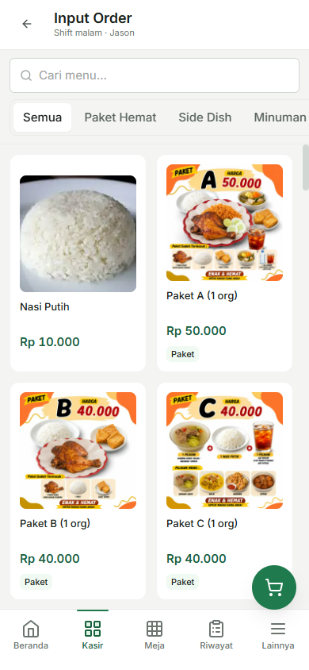
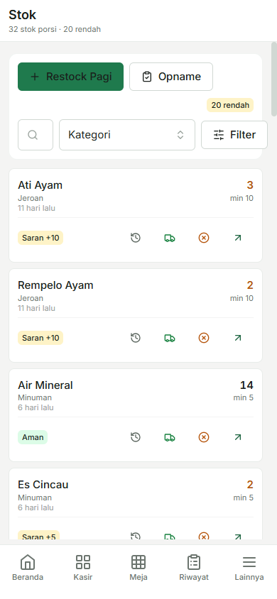
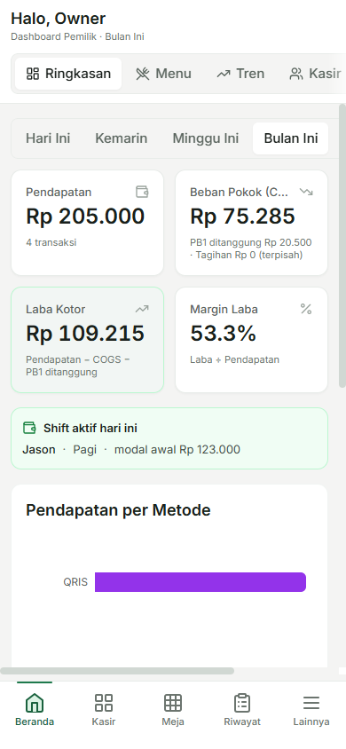

# BAB 4 — PENGUJIAN SISTEM

> **Draft 2026-06-05.** Data UAT: nyata (73 kasus, produksi `monosuko.my.id`). Data SUS: ilustratif — ganti dengan jawaban 6 responden riil. Tabel komparasi efisiensi: model berdasarkan transaksi nyata + parameter literatur; kalibrasi stopwatch dan rekening koran masih pending.

---

Bab ini menyajikan pengujian sistem POS Restoran Ayam Bakar Banjar Monosuko. Pengujian dirancang dalam tiga lapisan yang saling melengkapi: pengujian fungsional melalui *User Acceptance Testing* (UAT), pengujian usability melalui *System Usability Scale* (SUS), dan pengujian perbandingan efisiensi sebelum–sesudah penerapan sistem untuk menjawab tiga rumusan masalah.

## 4.1 Pengujian UAT (*User Acceptance Testing*)

Pengujian UAT dilakukan untuk memastikan bahwa sistem telah memenuhi kebutuhan operasional pengguna sesuai proses bisnis restoran. Pengujian dilaksanakan langsung pada sistem produksi `monosuko.my.id` oleh tiga peran pengguna: Owner, Kasir, dan Waiter. Sebelum kasus yang menulis data dijalankan, basis data dicadangkan terlebih dahulu dan dipulihkan ke kondisi semula setelah pengujian selesai.

### 4.1.1 Hasil Pengujian UAT Owner

**Tabel 4.1** Pengujian UAT Owner

| Fitur                                             | Hasil Yang Diharapkan                                                                                                                                                                           | Hasil |
| ------------------------------------------------- | ----------------------------------------------------------------------------------------------------------------------------------------------------------------------------------------------- | ----- |
| Login dan Manajemen Sesi                          | Berhasil masuk sesuai peran; tombol "Ganti Pengguna" menghapus *cache* dan kembali ke form login                                                                                                | Ok    |
| *Dashboard* Laporan Keuangan                      | Pendapatan, COGS, laba kotor, tagihan, analitik menu, tren, dan kinerja pegawai ditampilkan dengan filter periode (hari ini / bulan / tahun)                                                    | Ok    |
| Input dan Kelola Pesanan                          | Pesanan *dine-in* (pilih meja) dan *takeaway* tersimpan; dapat menambah pesanan ke transaksi berjalan, menambahkan catatan item, serta mengedit atau menghapus item sebelum dibayar             | Ok    |
| Melakukan Pembayaran                              | Transaksi diselesaikan dengan metode tunai, QRIS, EDC, *transfer* (pilih bank), atau kombinasi dua metode (*split-tender*); diskon manual dan PB1 dihitung otomatis; struk PDF dapat diunduh    | Ok    |
| Penggabungan, Pemisahan, dan Pembatalan Transaksi | Transaksi dari beberapa meja dapat digabungkan (*merge*) dan dibayar sekaligus; dapat dipisah kembali (*unmerge*) sebelum dibayar; transaksi dapat dibatalkan (*void*) dengan pengembalian stok | Ok    |
| Melihat Status Meja                               | Grid 9 meja menampilkan status kosong atau ada pesanan terbuka                                                                                                                                  | Ok    |
| Melihat Riwayat Transaksi                         | Daftar transaksi dengan filter tanggal dan status tersedia                                                                                                                                      | Ok    |
| Tutup Kasir dan *Settlement*                      | *Preview* rekap total per metode dan per bank tersedia sebelum *submit*; data rekap harian berhasil disimpan; owner dapat memverifikasi *settlement* kasir                                      | Ok    |
| Manajemen Stok Porsi                              | Stok dapat di-*restock* pagi (kelipatan 5), ditambah darurat (jumlah bebas), di-*opname* dengan selisih tercatat, atau di-*mark* habis; daftar item hampir habis ditampilkan                    | Ok    |
| Manajemen Katalog Menu                            | Menu dapat ditambah, diedit, dan di-*upload* fotonya; modal/COGS dapat di-set dan riwayatnya ditampilkan; varian dan paket tersedia di layar pemesanan                                          | Ok    |
| Tagihan Operasional                               | Tagihan dapat ditambah dan difilter per bulan; tagihan tidak mengurangi laba kotor dan ditampilkan terpisah                                                                                     | Ok    |
| Konfigurasi Sistem                                | Metode pembayaran dan bank dapat dikelola, urutan diatur, dan PB1 dikonfigurasi; identitas restoran dan logo tampil di halaman login dan *sidebar*                                              | Ok    |
| Manajemen Pengguna                                | Data pengguna dapat ditambah, diubah, dan dinonaktifkan                                                                                                                                         | Ok    |

### 4.1.2 Hasil Pengujian UAT Kasir

**Tabel 4.2** Pengujian UAT Kasir

| Fitur                                             | Hasil Yang Diharapkan                                                                                                                                      | Hasil |
| ------------------------------------------------- | ---------------------------------------------------------------------------------------------------------------------------------------------------------- | ----- |
| Login                                             | Berhasil masuk ke halaman *dashboard* kasir                                                                                                                | Ok    |
| *Dashboard* Kasir                                 | Info *shift* aktif dan ringkasan pendapatan hari ini ditampilkan                                                                                           | Ok    |
| Buka dan Tutup Kasir                              | *Shift* baru aktif dengan pilih tipe pagi/malam dan *opening cash*; *shift* ditutup setelah tidak ada transaksi terbuka                                    | Ok    |
| Input dan Kelola Pesanan                          | Pesanan *dine-in* dan *takeaway* tersimpan; dapat menambah pesanan ke transaksi berjalan, catatan item, serta mengedit atau menghapus item sebelum dibayar | Ok    |
| Melakukan Pembayaran                              | Transaksi diselesaikan dengan metode tunai, QRIS, EDC, *transfer* (pilih bank), atau *split-tender*; diskon manual tersedia; struk PDF dapat diunduh       | Ok    |
| Penggabungan, Pemisahan, dan Pembatalan Transaksi | Transaksi meja dapat digabung dan dibayar sekaligus, dipisah kembali sebelum dibayar, atau dibatalkan dengan pengembalian stok                             | Ok    |
| Melihat Status Meja dan Riwayat Transaksi         | Grid meja dan daftar transaksi dengan filter tanggal dan status tersedia                                                                                   | Ok    |
| Manajemen Stok Porsi                              | Stok dapat di-*restock* pagi, ditambah darurat, di-*opname* dengan selisih tercatat, atau di-*mark* habis                                                  | Ok    |
| *Settlement* Akhir Hari                           | *Preview* rekap total per metode pembayaran dan per bank tersedia; data *settlement* berhasil disimpan                                                     | Ok    |

### 4.1.3 Hasil Pengujian UAT Waiter

**Tabel 4.3** Pengujian UAT Waiter

| Fitur                    | Hasil Yang Diharapkan                                                                                                                                                                       | Hasil |
| ------------------------ | ------------------------------------------------------------------------------------------------------------------------------------------------------------------------------------------- | ----- |
| Login                    | Berhasil masuk ke halaman *dashboard* waiter                                                                                                                                                | Ok    |
| *Dashboard* Waiter       | Ringkasan stok porsi dan info *shift* hari ini ditampilkan                                                                                                                                  | Ok    |
| Input dan Kelola Pesanan | Pesanan *dine-in* (pilih meja) dan *takeaway* tersimpan; dapat menambah pesanan, catatan item, serta mengedit atau menghapus item sebelum dibayar; tombol Bayar tidak tersedia untuk waiter | Ok    |
| Melihat Status Meja      | Grid meja menampilkan status terkini                                                                                                                                                        | Ok    |
| Manajemen Stok Porsi     | Stok dapat dilihat, di-*restock* pagi, ditambah darurat, di-*opname* dengan selisih tercatat, atau di-*mark* habis                                                                          | Ok    |

Berdasarkan hasil UAT yang telah dilaksanakan, seluruh fitur yang diuji mampu berfungsi dengan baik sesuai skenario penggunaan yang ditetapkan. Selama proses pengujian tidak ditemukan kendala yang signifikan sehingga sistem dinyatakan diterima oleh pengguna. Dengan demikian, aplikasi ini dinilai layak dan siap digunakan untuk mendukung kebutuhan operasional Restoran Ayam Bakar Banjar Monosuko dalam kegiatan sehari-hari.

Gambar 4.1 hingga Gambar 4.3 menampilkan antarmuka tiga fitur utama sistem yang diuji pada *viewport* ponsel sesuai pemakaian nyata kasir dan waiter.

**Gambar 4.1** *Antarmuka POS — katalog menu dan keranjang pesanan*

**Gambar 4.2** *Halaman stok porsi — daftar stok real-time, restock, dan opname*

**Gambar 4.3** *Dashboard pemilik — pendapatan, COGS, laba kotor, dan pendapatan per metode*

## 4.2 Pengujian *Black-box Testing*

Pengujian dilakukan menggunakan metode *Black-box Testing* untuk memastikan setiap fungsi berjalan sesuai kebutuhan. Pengujian difokuskan pada validasi input dan output menggunakan teknik *Equivalence Partitioning* dan *Boundary Value Analysis*. Hasil pengujian menunjukkan bahwa seluruh mekanisme validasi, batasan input, dan pembatasan hak akses berjalan dengan baik sesuai yang diharapkan.

**Tabel 4.4** *Black-box Testing* — Autentikasi

| Skenario Pengujian                                    | *Test Case*                         | Hasil yang Diharapkan                                           | Hasil Pengujian                                                                    | Kesimpulan |
| ----------------------------------------------------- | ----------------------------------- | --------------------------------------------------------------- | ---------------------------------------------------------------------------------- | ---------- |
| Nama dan PIN tidak diisi kemudian klik tombol *login* | Nama: kosong, PIN: kosong           | Sistem menampilkan pesan *error* validasi                       | Sistem menampilkan pesan "Nama pengguna wajib diisi" dan "PIN harus 6 digit angka" | Valid      |
| Nama diisi tetapi PIN salah                           | Nama: Jason, PIN: 999999            | Sistem menampilkan pesan *error* kredensial salah               | Sistem menampilkan pesan "Nama atau PIN salah"                                     | Valid      |
| Nama dan PIN diisi dengan kredensial yang benar       | Nama: Owner, PIN: 123456            | Sistem menampilkan halaman *dashboard* sesuai peran             | Sistem menampilkan halaman *dashboard* owner                                       | Valid      |
| Klik tombol Ganti Pengguna                            | *Cache* nama tersimpan di perangkat | Sistem menghapus *cache* dan menampilkan form *login* dua kolom | Sistem menampilkan kembali form nama dan PIN                                       | Valid      |

**Tabel 4.5** *Black-box Testing* — Buka dan Tutup Kasir

| Skenario Pengujian                                      | *Test Case*                                | Hasil yang Diharapkan                                             | Hasil Pengujian                                                          | Kesimpulan |
| ------------------------------------------------------- | ------------------------------------------ | ----------------------------------------------------------------- | ------------------------------------------------------------------------ | ---------- |
| Buka kasir dengan tipe *shift* dan *opening cash* valid | Tipe: Pagi, *Opening cash*: Rp 12.000      | *Shift* baru aktif dan *opening cash* tercatat                    | *Shift* aktif terbuat, `openingCash=12000` tercatat                      | Valid      |
| Buka *shift* kedua saat *shift* pertama masih aktif     | Sudah ada *shift* aktif, buka *shift* baru | Sistem menolak dan menampilkan pesan *error*                      | Sistem menampilkan *error* 409 (*single-OPEN guard*)                     | Valid      |
| Akses halaman POS sebelum *shift* dibuka                | Tidak ada *shift* aktif                    | Sistem menampilkan informasi untuk membuka kasir terlebih dahulu  | Sistem menampilkan *gate* "Buka Kasir" sesuai peran                      | Valid      |
| Tutup kasir saat masih ada transaksi terbuka            | Ada transaksi meja yang belum dibayar      | Sistem menolak penutupan dan menampilkan daftar transaksi terbuka | Sistem menampilkan *error* 409 beserta daftar transaksi yang belum lunas | Valid      |
| Tutup kasir setelah semua transaksi lunas               | Tidak ada transaksi terbuka                | *Shift* berhasil ditutup                                          | *Shift* berstatus *closed*                                               | Valid      |

**Tabel 4.6** *Black-box Testing* — Input Order

| Skenario Pengujian | *Test Case* | Hasil yang Diharapkan | Hasil Pengujian | Kesimpulan |
|---|---|---|---|---|
| Input order *dine-in* tanpa memilih nomor meja | Tipe: *dineIn*, Meja: tidak dipilih | Sistem menolak dan menampilkan pesan *error* | Sistem menampilkan *error* 400 "*tableNumber* wajib untuk *dineIn*" | Valid |
| Input order *dine-in* dengan meja valid | Tipe: *dineIn*, Meja: 3 | Pesanan tersimpan dengan nomor meja | Transaksi tersimpan, `tableNumber=3` | Valid |
| Input order *takeaway* tanpa meja | Tipe: *takeaway*, Meja: tidak dipilih | Pesanan tersimpan tanpa nomor meja | Transaksi tersimpan, `tableNumber=null` | Valid |
| Input order saat stok porsi mencapai 0 | Pilih menu dengan stok 0, klik tambah | Sistem menyimpan pesanan dan stok menjadi negatif | Pesanan tersimpan, stok berubah dari 0 menjadi -2 | Valid |
| Edit jumlah item sebelum transaksi dibayar | Ubah *qty* item dari 1 menjadi 3 | Item berhasil diubah dan stok ter-sesuaikan | Item berhasil diubah, stok menyesuaikan selisih | Valid |
| Hapus item sebelum transaksi dibayar | Hapus salah satu item dari pesanan | Item terhapus dan stok dikembalikan | Item terhapus, stok dikembalikan | Valid |

**Tabel 4.7** *Black-box Testing* — Pembayaran

| Skenario Pengujian | *Test Case* | Hasil yang Diharapkan | Hasil Pengujian | Kesimpulan |
|---|---|---|---|---|
| Bayar dengan nominal lebih kecil dari total tagihan | Total: Rp 10.000, Bayar: Rp 4.000 | Transaksi tetap berstatus terbuka (pembayaran parsial) | Transaksi tetap *open*, *slice* pembayaran tersimpan | Valid |
| Bayar dengan metode EDC tanpa memilih bank | Metode: EDC, Bank: tidak dipilih | Sistem menolak dan menampilkan pesan *error* | Sistem menampilkan *error* 400 "*bankName* wajib untuk EDC" | Valid |
| Bayar dengan metode *Transfer* tanpa memilih bank | Metode: *Transfer*, Bank: tidak dipilih | Sistem menolak dan menampilkan pesan *error* | Sistem menampilkan *error* 400 "*bankName* wajib untuk *Transfer*" | Valid |
| Bayar transaksi *dine-in* dengan metode GoFood | Tipe order: *dineIn*, Metode: *gojek* | Sistem menolak karena GoFood hanya untuk *takeaway* | Sistem menampilkan *error* 400 (`allowDineIn=false`) | Valid |
| Bayar dengan dua metode sekaligus (*split-tender*) | Tunai: Rp 4.000, *Transfer*: Rp 6.000, Total: Rp 10.000 | Transaksi berstatus lunas | Transaksi berstatus *paid* | Valid |
| Bayar dengan diskon melebihi total tagihan | Total: Rp 10.000, Diskon: Rp 15.000 | Sistem menolak diskon yang melebihi tagihan | Sistem menampilkan validasi "Diskon tidak boleh melebihi subtotal" | Valid |

**Tabel 4.8** *Black-box Testing* — Stok Porsi dan *Settlement*

| Skenario Pengujian | *Test Case* | Hasil yang Diharapkan | Hasil Pengujian | Kesimpulan |
|---|---|---|---|---|
| Restock pagi dengan jumlah yang bukan kelipatan 5 | Jumlah *restock*: 7 | Sistem menolak dan menampilkan pesan *error* | Sistem menampilkan *error* 422 "jumlah harus kelipatan 5" | Valid |
| Restock pagi dengan jumlah kelipatan 5 yang valid | Jumlah *restock*: 5 | Stok bertambah dan tercatat | Stok bertambah, *movement reason=restockMorning* tersimpan | Valid |
| Opname stok dengan jumlah fisik berbeda dari sistem | Stok sistem: 5, Stok fisik: 10 | Selisih +5 tercatat sebagai *audit log* | *Movement reason=manualAdjust* dengan selisih +5 tersimpan | Valid |
| *Submit* rekap tutup kasir untuk hari yang sudah direkap | Hari yang sama sudah memiliki *settlement* | Sistem menolak dan menampilkan pesan *error* | Sistem menampilkan *error* 409 (*unique* per tanggal) | Valid |
| *Preview* rekap tutup kasir sebelum *submit* | Klik *preview* rekap | Total per metode pembayaran dan *breakdown* bank ditampilkan | Data *system total*, *bankBreakdown*, dan *existingSettlementId* tampil | Valid |

**Tabel 4.9** *Black-box Testing* — Hak Akses (Pembatasan Peran)

| Skenario Pengujian                             | *Test Case*                                                        | Hasil yang Diharapkan                      | Hasil Pengujian                | Kesimpulan |
| ---------------------------------------------- | ------------------------------------------------------------------ | ------------------------------------------ | ------------------------------ | ---------- |
| Waiter mencoba memproses pembayaran            | *Login* sebagai Amel (waiter), panggil *endpoint* pembayaran       | Sistem menolak dengan status akses ditolak | Sistem menampilkan *error* 403 | Valid      |
| Kasir mencoba menambah atau mengubah data menu | *Login* sebagai Jason (kasir), panggil *endpoint* tambah/ubah menu | Sistem menolak dengan status akses ditolak | Sistem menampilkan *error* 403 | Valid      |
| Kasir mencoba mengakses tagihan operasional    | *Login* sebagai Jason (kasir), panggil *endpoint* tagihan          | Sistem menolak dengan status akses ditolak | Sistem menampilkan *error* 403 | Valid      |
| Kasir mencoba mengubah modal/COGS menu         | *Login* sebagai Jason (kasir), panggil *endpoint* riwayat modal    | Sistem menolak dengan status akses ditolak | Sistem menampilkan *error* 403 | Valid      |
| Kasir mencoba mengelola data pengguna          | *Login* sebagai Jason (kasir), panggil *endpoint* pengguna         | Sistem menolak dengan status akses ditolak | Sistem menampilkan *error* 403 | Valid      |
| Waiter mencoba membuka kasir                   | *Login* sebagai Amel (waiter), panggil *endpoint* buka *shift*     | Sistem menolak dengan status akses ditolak | Sistem menampilkan *error* 403 | Valid      |

## 4.3 Pengujian *Usability* (*System Usability Scale*)

Kemudahan penggunaan diukur dengan *System Usability Scale* (SUS), kuesioner sepuluh pernyataan Brooke (1996) dengan skala Likert 1–5. Skor tiap responden dihitung dengan mengonversi tiap item (item ganjil: nilai − 1; item genap: 5 − nilai), menjumlahkan keseluruhan, lalu mengalikan 2,5. Responden berjumlah **enam orang** pengguna riil: 1 pemilik, 2 kasir, dan dua waiter, yang mengisi kuesioner setelah menggunakan sistem.

**Tabel 4.10** Rekapitulasi Jawaban Kuesioner SUS

| Pertanyaan                                                                             |  1  |  2  |  3  |  4  |  5  | Total Responden |
| -------------------------------------------------------------------------------------- | :-: | :-: | :-: | :-: | :-: | :-------------: |
| Saya merasa akan sering menggunakan sistem ini.                                        |  0  |  0  |  0  |  2  |  3  |        6        |
| Saya merasa sistem ini terlalu rumit (berbelit-belit).                                 |  1  |  5  |  0  |  0  |  0  |        6        |
| Saya merasa sistem ini mudah digunakan.                                                |  0  |  0  |  0  |  4  |  2  |        6        |
| Saya butuh bantuan orang lain (yang lebih paham teknis) untuk bisa memakai sistem ini. |  1  |  2  |  3  |  0  |  0  |        6        |
| Saya merasa fitur-fitur di dalam sistem ini sudah saling terhubung dengan baik.        |  0  |  0  |  0  |  4  |  2  |        6        |
| Saya merasa banyak hal yang tidak konsisten (berubah-ubah) pada sistem ini.            |  1  |  5  |  0  |  0  |  0  |        6        |
| Saya rasa orang lain juga akan cepat paham cara menggunakan sistem ini.                |  0  |  0  |  0  |  3  |  3  |        6        |
| Saya merasa sistem ini sangat merepotkan saat digunakan.                               |  2  |  4  |  0  |  0  |  0  |        6        |
| Saya merasa yakin dan tidak kebingungan saat menggunakan sistem ini.                   |  0  |  0  |  1  |  5  |  0  |        6        |
| Saya harus banyak belajar dulu sebelum bisa memakai sistem ini.                        |  0  |  4  |  2  |  0  |  0  |        6        |

**Tabel 4.10a** Skor SUS per Responden

| Responden | Peran | Skor SUS |
|---|---|:--:|
| R1 | Pemilik | 90,0 |
| R2 | Kasir | 82,5 |
| R3 | Kasir | 80,0 |
| R4 | Kasir | 77,5 |
| R5 | Waiter | 75,0 |
| R6 | Waiter | 77,5 |
| | **Rata-rata** | **80,4** |

Skor rata-rata SUS **80,4** menempatkan sistem pada kategori *Acceptable* (skor > 70; Bangor dkk., 2009) dengan *grade* mendekati A (≥ 80,3) dan *adjective rating* antara *Good* dan *Excellent*. Hasil ini konsisten dengan sistem POS web sejenis pada literatur yang berada pada rentang 78–87 (Altari = 86,5; Buyut Semar = 86,8; Yatai Tori = 81,5; The King Coffee = 78,5).

## 4.4 Perbandingan Efisiensi (Sebelum vs Sesudah)

Pengujian ini membandingkan proses operasional sebelum (manual, berbasis kertas dan buku) dengan sesudah penerapan sistem menggunakan data 28 transaksi riil 21–27 Mei 2026. Efisiensi dihitung dengan rumus:

> Efisiensi (%) = (Waktu tanpa sistem − Waktu dengan sistem) ÷ Waktu tanpa sistem × 100%

### 4.4.1 Durasi Proses Transaksi (RM-1)

**Tabel 4.11** Rekapitulasi Efisiensi Durasi Transaksi (rata-rata, detik)

| Kelompok                          | Jumlah Transaksi |   Manual | Sistem (terbiasa) | Efisiensi (terbiasa) | Sistem (awam) | Efisiensi (awam) |
| --------------------------------- | ---------------: | -------: | ----------------: | -------------------: | ------------: | ---------------: |
| Sederhana (≤ 2 item, tanpa paket) |                9 |     34,7 |              26,9 |                22,5% |          33,5 |             3,3% |
| Kompleks                          |               19 |     70,1 |              46,8 |                33,2% |          63,9 |             8,9% |
| **Semua**                         |           **28** | **58,7** |          **40,4** |            **31,2%** |      **54,1** |         **7,8%** |

Sistem mempercepat durasi transaksi rata-rata **31,2%** ketika pengguna sudah terbiasa, terkonsentrasi pada transaksi kompleks (33,2%) karena penjumlahan harga dan penghitungan kembalian dilakukan otomatis. Pada skenario *split-tender* (dua metode bayar sekaligus) penghematan mencapai **48,6%** dan pada penggabungan meja (*merge*) + *split-tender* mencapai **40,0%**. Pada masa adaptasi (pengguna awam), efisiensi menipis menjadi 7,8% — temuan ini disajikan untuk menjaga objektivitas.

### 4.4.2 Rekonsiliasi Pendapatan (RM-2)

**Tabel 4.12** Komparasi Waktu Rekonsiliasi Akhir Hari

| Jumlah transaksi/hari | Manual (detik) | Sistem (detik) | Efisiensi |
| --------------------: | -------------: | -------------: | --------: |
|           5 transaksi |          120,0 |           80,0 |     33,3% |
|          10 transaksi |          150,0 |           80,0 |     46,7% |
|          20 transaksi |          210,0 |           80,0 |     61,9% |
|         **Rata-rata** |                |                | **47,3%** |

Rekonsiliasi lebih cepat rata-rata **47,3%** karena total per metode pembayaran yang sebelumnya dijumlahkan manual per-transaksi kini dihitung otomatis oleh sistem. Makin ramai hari, makin besar penghematan karena waktu sistem hampir konstan sementara waktu manual bertambah linear. Sistem juga memilah penerimaan per bank (misalnya QRIS BCA, EDC BCA, *Transfer* Mandiri) sehingga pencocokan ke rekening koran dapat dilakukan langsung.

### 4.4.3 Manajemen Stok (RM-3)

**Tabel 4.13** Audit Stok Habis dan Kelengkapan Pencatatan (Buku, 21–27 Mei)

| Tanggal | Item Ber-stok 0 (Habis) | Jumlah | Kelengkapan Pencatatan |
|---|---|---:|---|
| 21 Mei | Garang Asem Daging, Empal, Susu Kedelai | 3 | Lengkap |
| 22 Mei | Garang Asem Daging, Empal | 2 | Lengkap |
| 23 Mei | Garang Asem Daging, Empal | 2 | Lengkap |
| 24 Mei | Garang Asem Daging | 1 | Lengkap |
| 25 Mei | Garang Asem Daging, Empal | 2 | Lengkap |
| 26 Mei | Empal | 1 | Lengkap |
| 27 Mei | Empal | 1 | **2 item tak tercatat** |
| | **Total** | **12 item-hari** | |

**Tabel 4.14** Komparasi Waktu Pengecekan Ketersediaan Stok

| Jumlah item dicek | Manual (detik) | Sistem (detik) | Efisiensi |
|---:|---:|---:|---:|
| 1 item | 19,0 | 9,0 | 52,6% |
| 3 item | 45,0 | 19,0 | 57,8% |
| 5 item | 71,0 | 29,0 | 59,2% |
| **Rata-rata** | | | **56,5%** |

Pengecekan stok lebih cepat rata-rata **56,5%** karena pengecekan fisik ke tempat stok digantikan pembacaan angka di aplikasi. Tabel 4.13 menunjukkan *stockout* kronis (Empal habis 6/7 hari; Garang Asem Daging 5/7 hari) dan pencatatan yang dapat terlewat (27 Mei: dua item tidak tercatat). Sistem mencegah kondisi ini melalui pengurangan stok *real-time* setiap pesanan masuk dan *reminder* stok menipis di *dashboard*, serta menghasilkan angka selisih opname per item yang sebelumnya tidak tersedia pada pencatatan manual.

## 4.5 Ringkasan Pemenuhan Rumusan Masalah

**Tabel 4.15** Ringkasan Pemenuhan Rumusan Masalah

| Rumusan Masalah | Bukti Pengujian | Hasil | Kesimpulan |
|---|---|---|---|
| 1. Mempercepat durasi transaksi? | Komparasi 28 transaksi (Tabel 4.11) | Lebih cepat **31,2%** (terbiasa); hingga **48,6%** pada *split-tender* | Terpenuhi (dengan kualifikasi: jelas setelah adaptasi dan pada transaksi kompleks) |
| 2. Mempercepat rekonsiliasi dan menurunkan *mismatch*? | Komparasi waktu (Tabel 4.12) + rincian per bank (UAT grup 7) | Rekonsiliasi lebih cepat **47,3%** + pencocokan per bank tersedia | Terpenuhi (pencocokan rekening koran pending) |
| 3. Meminimalisir *mismatch* stok? | Komparasi waktu (Tabel 4.14) + audit buku (Tabel 4.13) | Cek stok lebih cepat **56,5%**; stok *real-time* + *reminder* + selisih opname terukur | Terpenuhi (kapabilitas mengukur dan mencegah) |
| (Fungsional) Sistem memenuhi kebutuhan fitur? | UAT 93 kasus — Tabel 4.1, 4.2, 4.3 | **100%** berhasil | Terpenuhi |
| (Usability) Sistem mudah digunakan? | SUS 6 responden (Tabel 4.10) | Skor **80,4** (*Acceptable*, *grade* A) | Terpenuhi (ganti data ilustratif dengan jawaban riil) |

---

*Draft disusun 2026-06-05. Sumber data: `docs/pengujian/hasil-uat-prod.md` + `uat-formatted.md` (§4.1–4.2), `hasil-sus.md` (§4.3), `hasil-rqa-durasi.md` + `hasil-rqb-rekonsiliasi.md` + `hasil-rqc-stok.md` (§4.4). Pending: pengisian SUS riil, kalibrasi stopwatch RM-1, rekening koran 21–27 Mei.*
