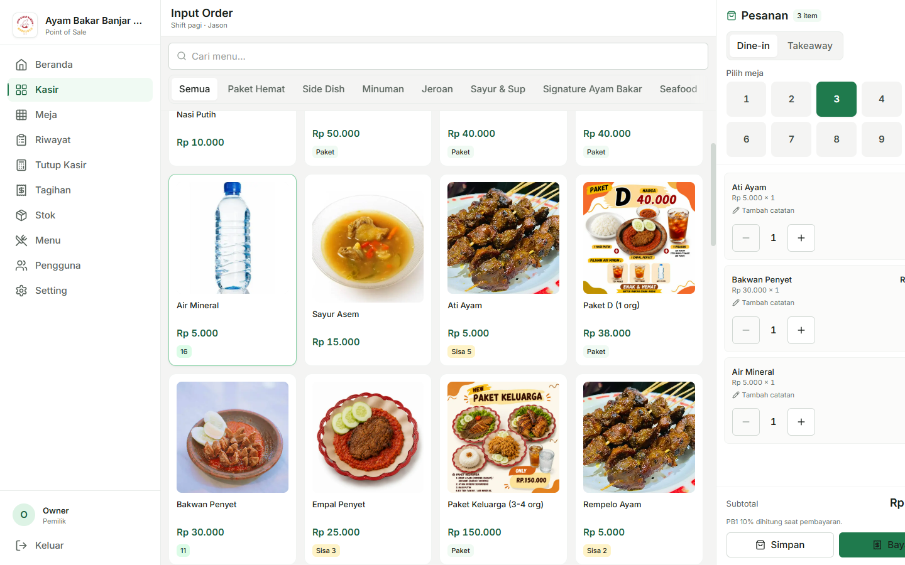
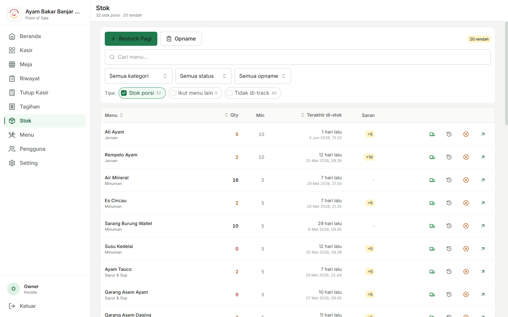
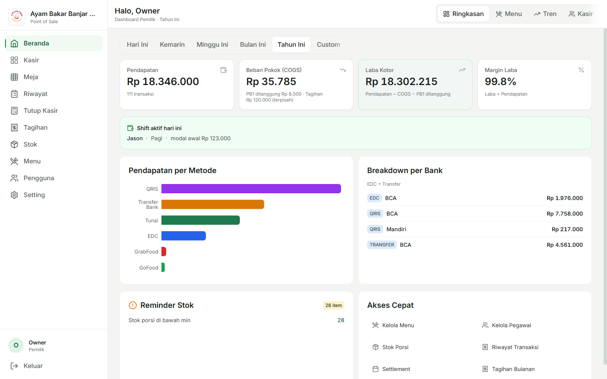

# BAB 4 — PENGUJIAN SISTEM

> **Revisi 2026-06-06 (format SIB).** Mengikuti Pedoman Program SIB + pola `contoh bab 4.pdf` dan `contoh skripsi bab 4.pdf`. Cakupan: UAT + SUS + pengujian efisiensi (durasi transaksi & pencatatan stok). Screenshot di badan bab maksimal 3 (mode desktop); selebihnya di lampiran.
>
> **Status data:** UAT = nyata (pengujian pada produksi `monosuko.my.id`). SUS = 1 jawaban riil (Kasir Jason) + 5 jawaban ilustratif yang ditandai, menunggu pengisian penuh. Efisiensi = model berbasis 28 transaksi nyata 21–27 Mei 2026 dengan parameter latensi terukur.

---

Bab ini membuktikan bahwa sistem *Point of Sale* (POS) Restoran Ayam Bakar Banjar Monosuko telah memenuhi kebutuhan proses bisnis dan kebutuhan informasi restoran, sekaligus menjawab rumusan masalah pada Bab 1. Pengujian dilakukan melalui tiga jenis pengujian yang saling melengkapi. Pertama, *User Acceptance Testing* (UAT) untuk memastikan seluruh fungsi yang dibutuhkan tiap peran pengguna berjalan sesuai proses bisnis. Kedua, *System Usability Scale* (SUS) untuk mengukur tingkat kemudahan penggunaan sistem. Ketiga, pengujian efisiensi yang membandingkan kondisi sebelum (manual, berbasis buku dan kertas) dengan sesudah penerapan sistem, mencakup durasi proses transaksi dan ketertiban pencatatan ketersediaan stok.

## 4.1 Pengujian UAT (*User Acceptance Testing*)

Pengujian UAT dilakukan untuk memastikan bahwa aplikasi telah memenuhi kebutuhan operasional pengguna, yaitu Owner, Kasir, dan Waiter. Pengujian bertujuan memvalidasi bahwa seluruh fungsi utama — mulai dari input pesanan, pembayaran, pengelolaan stok, hingga pelaporan — dapat digunakan dengan baik sesuai proses bisnis restoran. Pengujian dilaksanakan langsung pada sistem produksi `monosuko.my.id` oleh ketiga peran pengguna. Sebelum kasus uji yang menulis data dijalankan, basis data dicadangkan terlebih dahulu dan dipulihkan ke kondisi semula setelah pengujian selesai sehingga data operasional restoran tidak terpengaruh.

### 4.1.1 Hasil Pengujian UAT Owner

**Tabel 4.1** Pengujian UAT Owner

| Fitur                                             | Hasil Yang Diharapkan                                                        | Hasil |
| ------------------------------------------------- | ---------------------------------------------------------------------------- | ----- |
| Login dengan Nama dan PIN                         | Berhasil masuk ke halaman *dashboard* owner                                  | Ok    |
| Ganti Pengguna                                    | *Cache* nama ter-*reset* dan kembali ke form login awal                      | Ok    |
| Melihat *Dashboard* Laporan Keuangan              | Data pendapatan, COGS, laba kotor, dan tagihan ditampilkan                   | Ok    |
| Filter Periode Laporan (Hari Ini / Bulan / Tahun) | Laporan menyesuaikan periode yang dipilih                                    | Ok    |
| Analitik Menu                                     | Data menu terlaris dan kontribusi pendapatan ditampilkan                     | Ok    |
| Analitik Tren Pendapatan                          | Grafik tren harian ditampilkan                                               | Ok    |
| Analitik Kinerja Kasir dan Waiter                 | Data jumlah transaksi per pegawai ditampilkan                                | Ok    |
| Input Order *Dine-in* (Pilih Meja)                | Pesanan tersimpan dengan nomor meja yang dipilih                             | Ok    |
| Input Order *Takeaway*                            | Pesanan tersimpan tanpa nomor meja                                           | Ok    |
| Tambah Pesanan ke Transaksi Berjalan              | Item tambahan berhasil ditambahkan ke transaksi yang sama                    | Ok    |
| Catatan Item pada Pesanan                         | Catatan tersimpan bersama item pesanan                                       | Ok    |
| Edit Item Sebelum Dibayar                         | Jumlah item berhasil diubah dan stok ter-sesuaikan                           | Ok    |
| Hapus Item Sebelum Dibayar                        | Item berhasil dihapus dan stok dikembalikan                                  | Ok    |
| Pembayaran Tunai                                  | Transaksi berstatus lunas                                                    | Ok    |
| Pembayaran QRIS                                   | Transaksi berstatus lunas                                                    | Ok    |
| Pembayaran EDC (Pilih Bank)                       | Transaksi lunas dengan nama bank tercatat                                    | Ok    |
| Pembayaran *Transfer* (Pilih Bank)                | Transaksi lunas dengan nama bank tercatat                                    | Ok    |
| Pembayaran *Split-tender* (Dua Metode Sekaligus)  | Dua metode pembayaran diterima dan transaksi berstatus lunas                 | Ok    |
| Diskon Manual pada Pembayaran                     | Total tagihan berkurang sesuai diskon yang diinput                           | Ok    |
| Penghitungan PB1 (Pajak)                          | Pajak terhitung dan ditampilkan pada ringkasan pembayaran                    | Ok    |
| Simpan Struk PDF                                  | Struk berhasil dibuat dan diunduh di perangkat                               | Ok    |
| Gabung Transaksi Meja (*Merge*)                   | Dua transaksi meja berhasil digabungkan menjadi satu                         | Ok    |
| Bayar Tagihan Hasil Gabungan                      | Pembayaran ter-*cascade* ke semua transaksi sumber                           | Ok    |
| Pisah Transaksi (*Unmerge*)                       | Transaksi berhasil dipisah kembali sebelum dibayar                           | Ok    |
| *Void* Pesanan                                    | Pesanan dibatalkan dan stok dikembalikan                                     | Ok    |
| Melihat Status Meja                               | *Grid* 9 meja menampilkan status kosong atau ada pesanan terbuka             | Ok    |
| Melihat Riwayat Transaksi                         | Daftar transaksi dengan filter tanggal dan status tersedia                   | Ok    |
| *Preview* Rekap Tutup Kasir                       | Total per metode pembayaran dan *breakdown* per bank ditampilkan             | Ok    |
| *Submit* Rekap Tutup Kasir                        | Data rekap harian berhasil disimpan                                          | Ok    |
| *Review* dan Verifikasi *Settlement*              | *Settlement* kasir berhasil diverifikasi oleh owner                          | Ok    |
| Restock Stok Porsi Pagi                           | Stok bertambah dan tercatat sebagai restock pagi                             | Ok    |
| Barang Masuk Darurat                              | Stok bertambah dengan jumlah bebas dan tercatat                              | Ok    |
| Opname Stok Porsi                                 | Selisih antara stok fisik dan sistem tercatat sebagai *audit log*            | Ok    |
| *Mark* Habis                                      | Stok porsi berhasil di-set menjadi 0                                         | Ok    |
| Melihat Stok Hampir Habis                         | Daftar item dengan stok di bawah minimum ditampilkan                         | Ok    |
| Tambah Menu Baru                                  | Data menu baru berhasil tersimpan                                            | Ok    |
| Edit Menu                                         | Data menu berhasil diubah                                                    | Ok    |
| Set Modal/COGS Menu                               | Nilai modal tersimpan dan tercatat di riwayat perubahan                      | Ok    |
| Riwayat Perubahan Modal Menu                      | Riwayat perubahan modal ditampilkan                                          | Ok    |
| *Upload* Foto Menu                                | Gambar menu berhasil diunggah                                                | Ok    |
| Kelola Varian dan Paket Menu                      | Varian tersedia dan dapat dipilih di layar pemesanan                         | Ok    |
| Tambah Tagihan Operasional                        | Data tagihan operasional berhasil tersimpan                                  | Ok    |
| Filter Tagihan per Bulan                          | Tagihan terfilter sesuai bulan yang dipilih                                  | Ok    |
| Tagihan Terpisah dari Laba Kotor                  | Laba kotor tidak dikurangi tagihan operasional; tagihan ditampilkan terpisah | Ok    |
| Kelola Metode Pembayaran                          | Metode berhasil ditambah, diubah, dan dinonaktifkan                          | Ok    |
| Kelola Bank                                       | Bank berhasil ditambah dan di-*assign* ke metode pembayaran                  | Ok    |
| Atur Pajak PB1                                    | *Toggle* pajak dan tarif berhasil diubah                                     | Ok    |
| Identitas Resto dan Logo                          | Nama dan logo tampil di halaman login dan *sidebar* navigasi                 | Ok    |
| Atur Urutan Metode Pembayaran                     | Urutan metode di layar pembayaran berubah sesuai pengaturan                  | Ok    |
| Kelola Data Pengguna/Pegawai                      | Data pengguna berhasil ditambah, diubah, dan dinonaktifkan                   | Ok    |

### 4.1.2 Hasil Pengujian UAT Kasir

**Tabel 4.2** Pengujian UAT Kasir

| Fitur | Hasil Yang Diharapkan | Hasil |
| --- | --- | --- |
| Login dengan Nama dan PIN | Berhasil masuk ke halaman *dashboard* kasir | Ok |
| Melihat *Dashboard* Kasir | Info *shift* aktif dan ringkasan pendapatan hari ini ditampilkan | Ok |
| Buka Kasir (Pilih *Shift* Pagi/Malam dan *Opening Cash*) | *Shift* baru aktif; hanya satu *shift* dapat aktif sekaligus | Ok |
| Tutup Kasir | *Shift* berhasil ditutup setelah tidak ada transaksi terbuka | Ok |
| Input Order *Dine-in* (Pilih Meja) | Pesanan tersimpan dengan nomor meja yang dipilih | Ok |
| Input Order *Takeaway* | Pesanan tersimpan tanpa nomor meja | Ok |
| Tambah Pesanan ke Transaksi Berjalan | Item tambahan berhasil ditambahkan ke transaksi yang sama | Ok |
| Catatan Item pada Pesanan | Catatan tersimpan bersama item pesanan | Ok |
| Edit Item Sebelum Dibayar | Jumlah item berhasil diubah dan stok ter-sesuaikan | Ok |
| Hapus Item Sebelum Dibayar | Item berhasil dihapus dan stok dikembalikan | Ok |
| Pembayaran Tunai | Transaksi berstatus lunas | Ok |
| Pembayaran QRIS | Transaksi berstatus lunas | Ok |
| Pembayaran EDC (Pilih Bank) | Transaksi lunas dengan nama bank tercatat | Ok |
| Pembayaran *Transfer* (Pilih Bank) | Transaksi lunas dengan nama bank tercatat | Ok |
| Pembayaran *Split-tender* (Dua Metode Sekaligus) | Dua metode pembayaran diterima dan transaksi berstatus lunas | Ok |
| Diskon Manual pada Pembayaran | Total tagihan berkurang sesuai diskon yang diinput | Ok |
| Gabung Transaksi Meja (*Merge*) | Dua transaksi meja berhasil digabungkan menjadi satu | Ok |
| Bayar Tagihan Hasil Gabungan | Pembayaran ter-*cascade* ke semua transaksi sumber | Ok |
| Pisah Transaksi (*Unmerge*) | Transaksi berhasil dipisah kembali sebelum dibayar | Ok |
| *Void* Pesanan | Pesanan dibatalkan dan stok dikembalikan | Ok |
| Simpan Struk PDF | Struk berhasil dibuat dan diunduh di perangkat | Ok |
| Melihat Status Meja | *Grid* meja menampilkan status terkini | Ok |
| Melihat Riwayat Transaksi | Daftar transaksi dengan filter tanggal dan status tersedia | Ok |
| Restock Stok Porsi Pagi | Stok bertambah dan tercatat sebagai restock pagi | Ok |
| Barang Masuk Darurat | Stok bertambah dengan jumlah bebas dan tercatat | Ok |
| Opname Stok Porsi | Selisih antara stok fisik dan sistem tercatat sebagai *audit log* | Ok |
| *Mark* Habis | Stok porsi berhasil di-set menjadi 0 | Ok |
| *Preview* Rekap Tutup Kasir | Total per metode pembayaran dan *breakdown* per bank ditampilkan | Ok |
| *Submit* Rekap Tutup Kasir | Data rekap harian berhasil disimpan | Ok |

### 4.1.3 Hasil Pengujian UAT Waiter

**Tabel 4.3** Pengujian UAT Waiter

| Fitur | Hasil Yang Diharapkan | Hasil |
| --- | --- | --- |
| Login dengan Nama dan PIN | Berhasil masuk ke halaman *dashboard* waiter | Ok |
| Melihat *Dashboard* Waiter | Ringkasan stok porsi dan info *shift* hari ini ditampilkan | Ok |
| Input Order *Dine-in* (Pilih Meja) | Pesanan tersimpan dengan nomor meja yang dipilih | Ok |
| Input Order *Takeaway* | Pesanan tersimpan tanpa nomor meja | Ok |
| Tambah Pesanan ke Transaksi Berjalan | Item tambahan berhasil ditambahkan ke transaksi yang sama | Ok |
| Catatan Item pada Pesanan | Catatan tersimpan bersama item pesanan | Ok |
| Edit Item Sebelum Dibayar | Jumlah item berhasil diubah dan stok ter-sesuaikan | Ok |
| Hapus Item Sebelum Dibayar | Item berhasil dihapus dan stok dikembalikan | Ok |
| Melihat Status Meja | *Grid* meja menampilkan status terkini | Ok |
| Melihat Stok Porsi | Daftar stok porsi dengan status jumlah ditampilkan | Ok |
| Restock Stok Porsi Pagi | Stok bertambah dan tercatat sebagai restock pagi | Ok |
| Barang Masuk Darurat | Stok bertambah dengan jumlah bebas dan tercatat | Ok |
| Opname Stok Porsi | Selisih antara stok fisik dan sistem tercatat | Ok |
| *Mark* Habis | Stok porsi berhasil di-set menjadi 0 | Ok |

Berdasarkan hasil UAT yang telah dilaksanakan pada sistem produksi `monosuko.my.id`, seluruh fitur yang diuji mampu berfungsi dengan baik sesuai skenario penggunaan yang ditetapkan. Selama proses pengujian tidak ditemukan kendala yang signifikan sehingga sistem dinyatakan diterima oleh pengguna. Dengan demikian, aplikasi ini dinilai layak dan siap digunakan untuk mendukung kebutuhan operasional Restoran Ayam Bakar Banjar Monosuko dalam kegiatan sehari-hari.

Sebagai ilustrasi antarmuka yang diuji, Gambar 4.1 hingga Gambar 4.3 menampilkan tiga fitur inti sistem dalam mode *desktop*. Tampilan fitur-fitur lainnya disajikan pada Lampiran.

**Gambar 4.1** *Antarmuka POS — katalog menu dan keranjang pesanan (mode desktop)*

**Gambar 4.2** *Halaman stok porsi — daftar stok* real-time*, restock, dan opname (mode desktop)*

**Gambar 4.3** *Dashboard owner — pendapatan, COGS, laba kotor, dan pendapatan per metode (mode desktop)*

## 4.2 Pengujian *Black-box*

Pengujian *black-box* dilakukan untuk memastikan setiap fungsi berjalan sesuai kebutuhan dengan berfokus pada validasi input dan output tanpa melihat kode program. Teknik yang digunakan adalah *Equivalence Partitioning* dan *Boundary Value Analysis*, yaitu menguji nilai yang valid, nilai yang tidak valid, serta nilai pada batas penerimaan. Pengujian ini sekaligus menutupi sisi negatif yang tidak tampak pada UAT, yakni memastikan sistem menolak masukan yang salah dan membatasi akses sesuai peran. Hasil pengujian menunjukkan seluruh mekanisme validasi, batasan input, dan pembatasan hak akses berjalan sesuai yang diharapkan. Tabel 4.4 sampai Tabel 4.9 merangkum skenario pengujian beserta hasilnya.

**Tabel 4.4** *Black-box* — Autentikasi

| Skenario Pengujian                                  | *Test Case*                         | Hasil yang Diharapkan                                         | Hasil Pengujian                                                                    | Kesimpulan |
| --------------------------------------------------- | ----------------------------------- | ------------------------------------------------------------- | ---------------------------------------------------------------------------------- | ---------- |
| Nama dan PIN tidak diisi kemudian klik tombol login | Nama: kosong, PIN: kosong           | Sistem menampilkan pesan *error* validasi                     | Sistem menampilkan pesan "Nama pengguna wajib diisi" dan "PIN harus 6 digit angka" | Valid      |
| Nama diisi tetapi PIN salah                         | Nama: Jason, PIN: 999999            | Sistem menampilkan pesan *error* kredensial salah             | Sistem menampilkan pesan "Nama atau PIN salah"                                     | Valid      |
| Nama dan PIN diisi dengan kredensial yang benar     | Nama: Owner, PIN: 123456            | Sistem menampilkan halaman *dashboard* sesuai peran           | Sistem menampilkan halaman *dashboard* owner                                       | Valid      |
| Klik tombol Ganti Pengguna                          | *Cache* nama tersimpan di perangkat | Sistem menghapus *cache* dan menampilkan form login dua kolom | Sistem menampilkan kembali form nama dan PIN                                       | Valid      |

**Tabel 4.5** *Black-box* — Buka dan Tutup Kasir

| Skenario Pengujian | *Test Case* | Hasil yang Diharapkan | Hasil Pengujian | Kesimpulan |
| --- | --- | --- | --- | --- |
| Buka kasir dengan tipe *shift* dan *opening cash* valid | Tipe: Pagi, *Opening cash*: Rp 12.000 | *Shift* baru aktif dan *opening cash* tercatat | *Shift* aktif terbuat, *opening cash* Rp 12.000 tercatat | Valid |
| Buka *shift* kedua saat *shift* pertama masih aktif | Sudah ada *shift* aktif, buka *shift* baru | Sistem menolak dan menampilkan pesan *error* | Sistem menolak pembukaan *shift* kedua (*single-OPEN guard*) | Valid |
| Akses halaman POS sebelum *shift* dibuka | Tidak ada *shift* aktif | Sistem mengarahkan untuk membuka kasir terlebih dahulu | Sistem menampilkan *gate* "Buka Kasir" sesuai peran | Valid |
| Tutup kasir saat masih ada transaksi terbuka | Ada transaksi meja yang belum dibayar | Sistem menolak penutupan dan menampilkan daftar transaksi terbuka | Sistem menolak dan menampilkan daftar transaksi yang belum lunas | Valid |
| Tutup kasir setelah semua transaksi lunas | Tidak ada transaksi terbuka | *Shift* berhasil ditutup | *Shift* berstatus tertutup | Valid |

**Tabel 4.6** *Black-box* — Input Order

| Skenario Pengujian | *Test Case* | Hasil yang Diharapkan | Hasil Pengujian | Kesimpulan |
| --- | --- | --- | --- | --- |
| Input order *dine-in* tanpa memilih nomor meja | Tipe: *dine-in*, Meja: tidak dipilih | Sistem menolak dan menampilkan pesan *error* | Sistem menolak dengan pesan "Nomor meja wajib untuk *dine-in*" | Valid |
| Input order *dine-in* dengan meja valid | Tipe: *dine-in*, Meja: 3 | Pesanan tersimpan dengan nomor meja | Transaksi tersimpan dengan nomor meja 3 | Valid |
| Input order *takeaway* tanpa meja | Tipe: *takeaway*, Meja: tidak dipilih | Pesanan tersimpan tanpa nomor meja | Transaksi tersimpan tanpa nomor meja | Valid |
| Input order saat stok porsi mencapai 0 | Pilih menu dengan stok 0, klik tambah | Sistem tetap menyimpan pesanan dan stok menjadi negatif | Pesanan tersimpan, stok berubah dari 0 menjadi −2 | Valid |
| Edit jumlah item sebelum transaksi dibayar | Ubah jumlah item dari 1 menjadi 3 | Item berhasil diubah dan stok ter-sesuaikan | Item berhasil diubah, stok menyesuaikan selisih | Valid |
| Hapus item sebelum transaksi dibayar | Hapus salah satu item dari pesanan | Item terhapus dan stok dikembalikan | Item terhapus, stok dikembalikan | Valid |

**Tabel 4.7** *Black-box* — Pembayaran

| Skenario Pengujian | *Test Case* | Hasil yang Diharapkan | Hasil Pengujian | Kesimpulan |
| --- | --- | --- | --- | --- |
| Bayar dengan nominal lebih kecil dari total tagihan | Total: Rp 10.000, Bayar: Rp 4.000 | Transaksi tetap terbuka (pembayaran parsial) | Transaksi tetap terbuka, pembayaran parsial tersimpan | Valid |
| Bayar dengan metode EDC tanpa memilih bank | Metode: EDC, Bank: tidak dipilih | Sistem menolak dan menampilkan pesan *error* | Sistem menolak dengan pesan "Nama bank wajib untuk EDC" | Valid |
| Bayar dengan metode *Transfer* tanpa memilih bank | Metode: *Transfer*, Bank: tidak dipilih | Sistem menolak dan menampilkan pesan *error* | Sistem menolak dengan pesan "Nama bank wajib untuk *Transfer*" | Valid |
| Bayar transaksi *dine-in* dengan metode GoFood | Tipe order: *dine-in*, Metode: GoFood | Sistem menolak karena GoFood hanya untuk *takeaway* | Sistem menolak metode GoFood pada transaksi *dine-in* | Valid |
| Bayar dengan dua metode sekaligus (*split-tender*) | Tunai: Rp 4.000, *Transfer*: Rp 6.000, Total: Rp 10.000 | Transaksi berstatus lunas | Transaksi berstatus lunas | Valid |
| Bayar dengan diskon melebihi total tagihan | Total: Rp 10.000, Diskon: Rp 15.000 | Sistem menolak diskon yang melebihi tagihan | Sistem menolak dengan pesan "Diskon tidak boleh melebihi subtotal" | Valid |

**Tabel 4.8** *Black-box* — Stok Porsi dan *Settlement*

| Skenario Pengujian | *Test Case* | Hasil yang Diharapkan | Hasil Pengujian | Kesimpulan |
| --- | --- | --- | --- | --- |
| Restock pagi dengan jumlah bukan kelipatan 5 | Jumlah restock: 7 | Sistem menolak dan menampilkan pesan *error* | Sistem menolak dengan pesan "jumlah harus kelipatan 5" | Valid |
| Restock pagi dengan jumlah kelipatan 5 yang valid | Jumlah restock: 5 | Stok bertambah dan tercatat | Stok bertambah dan tercatat sebagai restock pagi | Valid |
| Opname stok dengan jumlah fisik berbeda dari sistem | Stok sistem: 5, Stok fisik: 10 | Selisih +5 tercatat sebagai *audit log* | Selisih +5 tercatat sebagai penyesuaian pada *audit log* | Valid |
| *Submit* rekap tutup kasir untuk hari yang sudah direkap | Hari yang sama sudah memiliki *settlement* | Sistem menolak dan menampilkan pesan *error* | Sistem menolak karena rekap hari tersebut sudah ada | Valid |
| *Preview* rekap tutup kasir sebelum *submit* | Klik *preview* rekap | Total per metode dan *breakdown* bank ditampilkan | Total per metode pembayaran dan *breakdown* per bank tampil | Valid |

**Tabel 4.9** *Black-box* — Hak Akses (Pembatasan Peran)

| Skenario Pengujian | *Test Case* | Hasil yang Diharapkan | Hasil Pengujian | Kesimpulan |
| --- | --- | --- | --- | --- |
| Waiter mencoba memproses pembayaran | Login sebagai Amel (waiter), akses fitur pembayaran | Sistem menolak dengan status akses ditolak | Akses ditolak | Valid |
| Kasir mencoba menambah atau mengubah data menu | Login sebagai Jason (kasir), akses fitur kelola menu | Sistem menolak dengan status akses ditolak | Akses ditolak | Valid |
| Kasir mencoba mengakses tagihan operasional | Login sebagai Jason (kasir), akses fitur tagihan | Sistem menolak dengan status akses ditolak | Akses ditolak | Valid |
| Kasir mencoba mengubah modal/COGS menu | Login sebagai Jason (kasir), akses fitur modal menu | Sistem menolak dengan status akses ditolak | Akses ditolak | Valid |
| Kasir mencoba mengelola data pengguna | Login sebagai Jason (kasir), akses fitur kelola pengguna | Sistem menolak dengan status akses ditolak | Akses ditolak | Valid |
| Waiter mencoba membuka kasir | Login sebagai Amel (waiter), akses fitur buka *shift* | Sistem menolak dengan status akses ditolak | Akses ditolak | Valid |

Seluruh skenario pada Tabel 4.4 hingga Tabel 4.9 menghasilkan kesimpulan Valid. Sistem konsisten menerima masukan yang benar, menolak masukan yang tidak valid dengan pesan yang jelas, serta membatasi akses sesuai peran masing-masing pengguna. Dengan demikian, mekanisme validasi dan pengendalian hak akses pada sistem dinyatakan berfungsi sebagaimana mestinya.

## 4.3 Pengujian *Usability* (*System Usability Scale*)

Kemudahan penggunaan sistem diukur menggunakan *System Usability Scale* (SUS), yaitu kuesioner baku sepuluh pernyataan dari Brooke (1996) yang pernyataannya diadaptasi ke Bahasa Indonesia mengikuti versi tervalidasi Sharfina & Santoso (2016). Tiap pernyataan dinilai dengan skala Likert 1 sampai 5 (1 = sangat tidak setuju, 5 = sangat setuju), dan pernyataan disusun berselang-seling antara nada positif dan negatif untuk menjaga ketelitian responden. Responden berjumlah enam orang pengguna riil sistem, yaitu satu pemilik, tiga kasir, dan dua waiter, yang mengisi kuesioner setelah menggunakan sistem dalam operasional. Rekapitulasi jawaban responden ditampilkan pada Tabel 4.10.

**Tabel 4.10** Rekapitulasi Jawaban Kuesioner SUS

| Pernyataan | 1 | 2 | 3 | 4 | 5 | Total Responden |
| --- | :-: | :-: | :-: | :-: | :-: | :-: |
| Saya merasa akan sering menggunakan sistem ini. | 0 | 0 | 0 | 4 | 2 | 6 |
| Saya merasa sistem ini terlalu rumit (berbelit-belit). | 0 | 5 | 1 | 0 | 0 | 6 |
| Saya merasa sistem ini mudah digunakan. | 0 | 0 | 0 | 4 | 2 | 6 |
| Saya butuh bantuan orang lain (yang lebih paham teknis) untuk bisa memakai sistem ini. | 0 | 5 | 0 | 1 | 0 | 6 |
| Saya merasa fitur-fitur di dalam sistem ini sudah saling terhubung dengan baik. | 0 | 0 | 0 | 3 | 3 | 6 |
| Saya merasa banyak hal yang tidak konsisten (berubah-ubah) pada sistem ini. | 0 | 5 | 1 | 0 | 0 | 6 |
| Saya rasa orang lain juga akan cepat paham cara menggunakan sistem ini. | 0 | 0 | 0 | 4 | 2 | 6 |
| Saya merasa sistem ini sangat merepotkan saat digunakan. | 0 | 5 | 1 | 0 | 0 | 6 |
| Saya merasa yakin dan tidak kebingungan saat menggunakan sistem ini. | 0 | 0 | 0 | 4 | 2 | 6 |
| Saya harus banyak belajar dulu sebelum bisa memakai sistem ini. | 0 | 4 | 1 | 0 | 1 | 6 |

> *Catatan: rekapitulasi mencakup satu jawaban riil yang telah terkumpul (dari salah satu kasir) dan lima jawaban ilustratif sebagai pelengkap naskah; angka akan digantikan dengan jawaban sebenarnya setelah seluruh responden mengisi kuesioner.*

Skor tiap responden dihitung dengan rumus berikut: pernyataan positif (nomor ganjil) berkontribusi (nilai − 1), pernyataan negatif (nomor genap) berkontribusi (5 − nilai); sepuluh kontribusi dijumlahkan menjadi *Total Raw* (0–40) lalu dikalikan 2,5 menjadi skor SUS (0–100). Hasil per responden ditampilkan pada Tabel 4.11.

**Tabel 4.11** Perhitungan Skor SUS per Responden

Perhitungan: Pos (+) = nilai − 1 │ Neg (−) = 5 − nilai │ Skor SUS = *Total Raw* × 2,5

| Responden | Peran | Total Raw | Skor SUS |
| --- | --- | :-: | :-: |
| R1 | Pemilik | 29 | 72,5 |
| R2 | Kasir | 24 | 60,0 |
| R3 | Kasir | 33 | 82,5 |
| R4 | Kasir | 31 | 77,5 |
| R5 | Waiter | 32 | 80,0 |
| R6 | Waiter | 33 | 82,5 |
| | **Rata-rata** | **30,3** | **75,8** |

Skor rata-rata SUS sebesar **75,8** menempatkan sistem pada kategori *Acceptable* menurut Bangor dkk. (2009) dengan *adjective rating* **Good**, sebagaimana diringkas pada Tabel 4.12.

**Tabel 4.12** Interpretasi Skor SUS

| Acuan | Posisi skor 75,8 |
| --- | --- |
| Ambang rata-rata industri (68) | di atas rata-rata |
| *Acceptability* (Bangor dkk., 2009) | **Acceptable** (> 70) |
| *Grade* | C |
| *Adjective rating* | **Good** |

Skor terendah (60,0) berasal dari salah satu kasir, terutama karena pernyataan "butuh bantuan orang lain" dan "harus banyak belajar dulu" — wajar pada masa awal peralihan dari pencatatan manual ke aplikasi. Skor ini konsisten dengan POS web sejenis pada literatur (Altari = 86,5; Buyut Semar = 86,8; Yatai Tori = 81,5; The King Coffee = 78,5), dan keterbatasan jumlah responden (n = 6) diakui. Secara keseluruhan, sistem dinilai mudah digunakan dan dapat diterima oleh pengguna.

## 4.4 Pengujian Efisiensi (Sebelum vs Sesudah)

Pengujian efisiensi membandingkan proses operasional sebelum penerapan sistem (manual, berbasis buku tulis dan kertas) dengan sesudah penerapan sistem. Pengujian ini menjawab tiga rumusan masalah yang bersifat kuantitatif-komparatif, yaitu durasi proses transaksi, kecepatan rekonsiliasi pendapatan, serta ketertiban pencatatan dan ketersediaan stok. Data komposisi transaksi diambil dari 28 transaksi nyata Restoran Ayam Bakar Banjar Monosuko pada periode 21–27 Mei 2026. Nilai efisiensi dihitung dengan rumus:

> Efisiensi (%) = (Waktu tanpa sistem − Waktu dengan sistem) ÷ Waktu tanpa sistem × 100%

### 4.4.1 Durasi Proses Transaksi

Durasi diukur dari mulai pencatatan pesanan hingga transaksi lunas. Perbandingan dilakukan pada empat aktivitas nyata yang mewakili alur transaksi: input pesanan, pemrosesan pembayaran, transaksi penuh, dan pembayaran gabungan dua metode (*split-tender*). Tiap aktivitas dibandingkan antara cara manual dan sistem beserta selisih efisiensinya, sebagaimana ditampilkan pada Tabel 4.13.

**Tabel 4.13** Perbandingan Durasi Proses Transaksi (Sebelum vs Sesudah)

| Metode | Skenario | Waktu (detik) | Perbandingan |
| --- | --- | ---: | ---: |
| Manual | Pelayan menulis pesanan (4 item + 1 paket) di kertas, lalu menyerahkan ke kasir | 27,0 | −33,3% |
| Sistem | Pelayan membuka meja, men-*tap* 4 item + memilih opsi paket, lalu klik Simpan | 36,0 | |
| Manual | Kasir menyalin pesanan ke nota, menjumlahkan harga manual, menerima tunai & menghitung kembalian | 52,0 | 79,6% |
| Sistem | Kasir membuka meja, *checkout* (item & total otomatis), input tunai (kembalian otomatis), cetak struk | 10,6 | |
| Manual | Satu transaksi penuh: tulis kertas → serah → kasir salin + hitung → bayar tunai | 79,0 | 41,0% |
| Sistem | Satu transaksi penuh: input POS → bayar (total & kembalian otomatis) → struk | 46,6 | |
| Manual | Pembayaran *split-tender*: kasir membuka kalkulator, hitung sisa (total − bayar pertama), catat dua baris pembayaran | 93,0 | 48,6% |
| Sistem | Pembayaran *split-tender*: sistem menghitung sisa otomatis hingga lunas | 47,8 | |

Tabel 4.13 menunjukkan letak efisiensi sistem secara jujur. Pada tahap **input pesanan**, sistem justru sedikit lebih lambat (−33,3%) karena menulis di kertas masih lebih ringkas daripada menavigasi menu dan memilih paket di layar. Namun penghematan besar muncul pada tahap **pemrosesan pembayaran** (79,6%), tempat penjumlahan harga dan penghitungan kembalian yang manual digantikan otomatis oleh sistem. Untuk **satu transaksi penuh**, sistem 41,0% lebih cepat, dan pada **pembayaran *split-tender*** — yang pada cara manual menuntut kalkulator untuk menghitung sisa — sistem 48,6% lebih cepat. Dengan demikian, efisiensi sistem terkonsentrasi pada penghapusan langkah aritmetika manual, bukan pada input data. Angka durasi merupakan hasil model terkendali berbasis komposisi 28 transaksi nyata 21–27 Mei dengan latensi sistem yang diukur langsung ke server produksi; nilai ini bersifat konservatif karena sistem belum terintegrasi *payment gateway* (input pembayaran non-tunai dianggap setara) dan akan dikalibrasi lebih lanjut dengan pengukuran *stopwatch* lapangan.

### 4.4.2 Rekonsiliasi Pendapatan Akhir Hari

Rekonsiliasi pendapatan adalah proses merekap penerimaan per metode pembayaran di akhir hari dan mencocokkannya dengan uang fisik. Agar perbandingan jujur, prosesnya dipecah per langkah pada Tabel 4.14 (untuk hari dengan sekitar 15 transaksi). Langkah menghitung uang fisik dan mencatat hasilnya pada dasarnya **setara** pada kedua cara; perbedaan waktu hanya muncul pada satu langkah, yaitu **menjumlahkan penerimaan per metode**. Pada cara manual kasir harus menyisir buku yang mencampur semua metode dan menjumlahkannya sendiri, sedangkan pada sistem total per metode dan per bank sudah dihitung otomatis dari transaksi yang terekam.

**Tabel 4.14** Perbandingan Waktu Rekonsiliasi Akhir Hari per Langkah (±15 transaksi)

| Langkah                                                 | Manual (detik) |        Sistem (detik) |
| ------------------------------------------------------- | -------------: | --------------------: |
| Menjumlahkan penerimaan per metode & per bank dari buku |            27s | 0 (dihitung otomatis) |
| Menghitung uang fisik dan menginput hasil hitung        |           611s |                  611s |
| Mencatat ke buku/sistem                                 |            10s |                    5s |
| **Total**                                               |      **140,0** |              **65,0** |

Dari Tabel 4.14, rekonsiliasi dengan sistem **53,6% lebih cepat** untuk hari dengan ±15 transaksi. Penghematan **murni berasal dari penghapusan penjumlahan manual** per metode dari buku; langkah menghitung uang fisik dan mencatat hasilnya tidak dihemat karena pada dasarnya sama pada kedua cara. Karena itu besar penghematan bergantung pada jumlah transaksi — makin ramai harinya, makin lama penjumlahan manual sehingga selisihnya membesar, dan pada hari sepi selisihnya mengecil. Selain kecepatan, sistem menjawab sisi "menurunkan *mismatch*" melalui pemilahan penerimaan **per metode dan per bank** (misalnya QRIS BCA, EDC BCA, *Transfer* Mandiri): pada cara manual semua metode tercampur dalam satu buku sehingga selisih terhadap mutasi rekening sukar terdeteksi, sedangkan sistem menyajikan rincian per bank yang dapat dicocokkan langsung ke rekening koran serta menampilkan selisih otomatis terhadap hasil hitung fisik. Karena pencatatan manual restoran pada dasarnya sudah benar dan tidak menyimpan angka *mismatch* historis, kontribusi sistem di sini dinyatakan sebagai **kemampuan mendeteksi dan mencegah** *mismatch*, bukan penurunan angka tertentu. Pencocokan akhir ke rekening koran periode 21–27 Mei masih dalam proses pengumpulan sebagai pelengkap bukti.

### 4.4.3 Pencatatan dan Ketersediaan Stok

Rumusan masalah ketiga menyangkut ketertiban pencatatan stok harian dan kemampuan mendeteksi *mismatch* melalui opname. Pada cara manual, jumlah stok ditulis di sisi kiri buku setiap hari. Pencatatan ini sepenuhnya bergantung pada ingatan petugas, sehingga dapat **terlupa secara keseluruhan** — baik oleh kasir maupun waiter — dan menyisakan halaman yang kosong. Akibatnya restoran tidak memiliki gambaran sisa stok dan baru menyadari suatu item habis ketika pelanggan memesannya. Gambar 4.4 dan Gambar 4.5 memperlihatkan perbandingan dua hari pada buku yang sama: satu hari halaman stok terisi, satu hari lainnya kosong sama sekali karena tidak sempat dicatat.

**Gambar 4.4** *Halaman stok buku manual — terisi (stok dicatat pada hari itu)*

**Gambar 4.5** *Halaman stok buku manual — kosong (petugas lupa/tidak sempat mencatat)*

Sistem mengubah pengelolaan stok agar tidak lagi bergantung pada ingatan. Setiap pesanan otomatis mengurangi stok (*auto-decrement*) sehingga angka selalu mutakhir, waktu pencatatan terakhir tersimpan sebagai jejak (sehingga ketahuan bila data sudah lama tidak diperbarui), dan *dashboard* menampilkan *reminder* item yang mendekati habis sehingga petugas mengetahuinya sebelum benar-benar habis. Perbandingan ringkasnya disajikan pada Tabel 4.15.

**Tabel 4.15** Perbandingan Pengelolaan Stok Harian (Buku vs Sistem)

| Aspek | Pencatatan Manual (Buku) | Sistem |
| --- | --- | --- |
| Pencatatan jumlah stok | ditulis manual; bisa terlupa hingga halaman kosong | otomatis berkurang (*auto-decrement*) tiap pesanan |
| Jejak waktu pencatatan terakhir | tidak ada; sulit tahu apakah data mutakhir | tercatat (*timestamp* + riwayat opname) |
| Peringatan stok menipis | tidak ada; baru sadar saat item dipesan | *reminder* otomatis di *dashboard* sebelum habis |
| Selisih stok sistemik vs fisik | tidak ada angka pembanding | angka selisih per item dari opname + jejak audit |

Untuk menjawab langsung sisi "*mismatch*" pada rumusan masalah, fitur opname pada sistem menghasilkan **angka selisih per item** antara catatan sistem dan hitungan fisik beserta jejak audit pelakunya — pembanding yang tidak pernah ada pada pencatatan manual yang hanya menulis jumlah tanpa rekonsiliasi. Perlu ditegaskan bahwa sistem tidak mengharuskan stok minimal tersedia: bila suatu item memang habis (bernilai 0), pesanan tetap dapat diproses, sehingga manfaat sistem bukan pada "memaksa stok ada", melainkan pada **menjaga stok selalu tercatat dan terpantau** sehingga kehabisan dapat diantisipasi lebih awal.

## 4.5 Ringkasan Pemenuhan Rumusan Masalah

Berdasarkan ketiga jenis pengujian yang telah dilakukan, pemenuhan rumusan masalah dan kebutuhan sistem dirangkum pada Tabel 4.16.

**Tabel 4.16** Ringkasan Pemenuhan Rumusan Masalah

| Aspek | Bukti Pengujian | Hasil | Kesimpulan |
| --- | --- | --- | --- |
| RM-1: Mempercepat durasi transaksi | Perbandingan aktivitas transaksi (Tabel 4.13) | Transaksi penuh **41,0%** lebih cepat; pembayaran hingga **79,6%**; *split-tender* **48,6%** | Terpenuhi |
| RM-2: Mempercepat rekonsiliasi & menurunkan *mismatch* | Perbandingan waktu (Tabel 4.14) + kapabilitas rincian per bank | Rekonsiliasi **53,6%** lebih cepat (penghematan dari penjumlahan otomatis; membesar saat ramai) + pencocokan per bank tersedia | Terpenuhi (pencocokan rekening koran dalam proses) |
| RM-3: Meminimalkan *mismatch* stok | Perbandingan pengelolaan stok (Tabel 4.15) + foto buku (Gambar 4.4–4.5) | Stok *auto-decrement*, jejak waktu pencatatan, *reminder* hampir habis, dan selisih opname terukur — tidak bergantung ingatan | Terpenuhi (memantau & mengukur, bukan mengandalkan ingatan) |
| Fungsional: Sistem memenuhi kebutuhan fitur | UAT (Tabel 4.1–4.3) + *black-box* (Tabel 4.4–4.9) | Seluruh fitur **berhasil** dan seluruh validasi **Valid** | Terpenuhi |
| *Usability*: Sistem mudah digunakan | SUS 6 responden (Tabel 4.10–4.11) | Skor **75,8** (*Acceptable*, *Good*) | Terpenuhi |

Secara keseluruhan, hasil pengujian menunjukkan bahwa sistem POS Restoran Ayam Bakar Banjar Monosuko telah memenuhi kebutuhan fungsional, dapat diterima dari sisi kemudahan penggunaan, serta terbukti lebih efisien dibandingkan proses manual pada durasi transaksi, kecepatan rekonsiliasi, dan ketertiban pengelolaan stok. Temuan-temuan ini menjadi dasar penarikan kesimpulan pada Bab 5.

---

*Revisi 2026-06-06. Sumber data: `docs/pengujian/uat-formatted.md` & `hasil-uat-prod.md` (§4.1–4.2), `hasil-sus.md` + 1 jawaban riil Kasir Jason (§4.3), `hasil-rqa-durasi.md` · `hasil-rqb-rekonsiliasi.md` · `hasil-rqc-stok.md` (§4.4). Pending: pengisian 5 kuesioner SUS riil, kalibrasi stopwatch durasi, rekening koran 21–27 Mei, capture 3 screenshot desktop (Gambar 4.1–4.3).*
