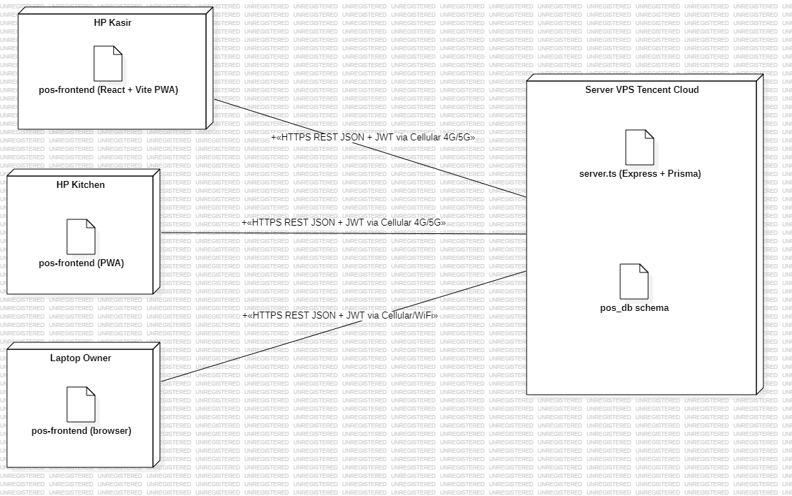
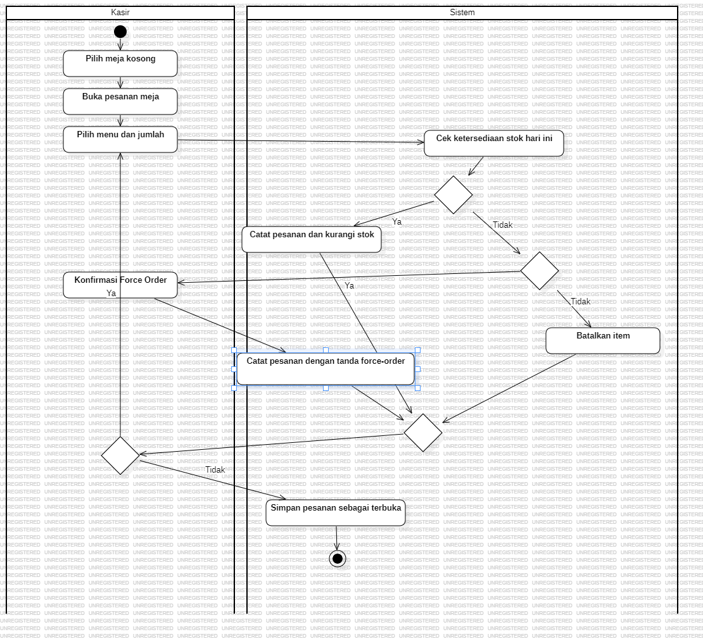
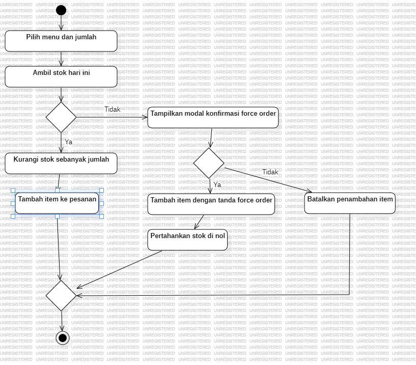

# Full Knowledge — Sistem POS Ayam Bakar Banjar Monosuko

Kompilasi lengkap pengetahuan tentang semua diagram skripsi ini. Dokumen ini **self-contained** — reviewer, dosen pembimbing, atau future agent bisa baca satu file ini dan memahami seluruh design.

Untuk deep-dive per jenis diagram, lihat file terpisah:
- [USE-CASE.md](USE-CASE.md) — Use Case Diagram detail
- [ACTIVITY.md](ACTIVITY.md) — 7 Activity Diagrams detail
- [ERD.md](ERD.md) — Entity Relationship Diagram detail
- (sequence diagrams dijelaskan singkat di §6 dokumen ini)

File terkait:
- [DIAGRAM-SPEC.md](../DIAGRAM-SPEC.md) — design specification (pre-build)
- [DATA-DICTIONARY.md](../DATA-DICTIONARY.md) — 8 tabel data dictionary (Bab 3 paste-ready)
- [diagrams/INDEX.md](../diagrams/INDEX.md) — gallery PNG hasil render
- [planning/DIAGRAM-PLAN.md](../planning/DIAGRAM-PLAN.md) — 6 keputusan awal design

---

## 1. Konteks Skripsi

**Judul:** Pembuatan Sistem Point of Sales (POS) pada Restoran X (Ayam Bakar Banjar Monosuko)
**Penyusun:** Ezra Brilliant Konterliem (C14220315), Sistem Informasi Bisnis UK Petra.

### 1.1. Masalah yang Dipecahkan (Bab 1.1)

1. Semua order + stok + pengeluaran dicatat manual di **satu buku tulis** dua sisi. Kekacauan administrasi.
2. Pegawai lupa opname pagi → kasir tidak tau stok → pernah GoSend dari rumah pemilik saat stok habis.
3. Pencatatan 3 metode bayar (cash/EDC/QRIS) manual → mismatch tidak terdeteksi.
4. Owner tidak tau persis pendapatan + pengeluaran bulanan.

### 1.2. Batasan Penelitian (dari Sidang Proposal)
- Tidak hitung HPP (dosen penguji: tidak perlu)
- Pengeluaran dicatat total + kategori (tidak per-bahan)
- PWA Level A (installable, tetap butuh internet)

### 1.3. Stack Teknis (final per plan)
- Backend: Node.js 20 + Express 4 + TypeScript + Prisma + MySQL 8
- Frontend: React 18 + Vite (PWA Level A)
- Auth: JWT + PIN 6-digit
- Role: `owner`, `cashier`, `kitchen`

---

## 2. Tiga Aktor Sistem

| Aktor | Role DB | Tanggung Jawab |
|---|---|---|
| **Owner** | `owner` | Master data (menu, pengguna), catat pengeluaran, monitoring dashboard & laporan, otorisasi void |
| **Kasir / Cashier** | `cashier` | Operasional POS: buka/tutup kasir, order, split/merge bill, bayar, struk, opname |
| **Kitchen** | `kitchen` | Input stok masuk pagi (1 use case saja) |

---

## 3. Blok Diagram Sistem (Deployment)

### Ringkasan

Diagram deployment yang menggambarkan topology fisik sistem POS. Karena resto **tidak punya WiFi internal** (WiFi resto tetangga tidak reliable, jadi setiap device pakai paket data sendiri), dan server di-host di **VPS Tencent Cloud** (1 tahun ~$10), arsitekturnya:

| Node | Tipe | Isi |
|---|---|---|
| HP Kasir | Device | `pos-frontend (React + Vite PWA)` artifact |
| HP Kitchen | Device | `pos-frontend (PWA)` artifact (same bundle, login berbeda role) |
| Laptop Owner | Device | `pos-frontend (browser)` artifact |
| Server VPS Tencent Cloud | Device | `server.ts (Express + Prisma)` + `pos_db schema` artifacts |

**Communication paths** (semua direct via internet, tanpa router lokal):

| From | To | Stereotype |
|---|---|---|
| HP Kasir | Server VPS | `«HTTPS REST JSON + JWT via Cellular 4G/5G»` |
| HP Kitchen | Server VPS | `«HTTPS REST JSON + JWT via Cellular 4G/5G»` |
| Laptop Owner | Server VPS | `«HTTPS REST JSON + JWT via Cellular/WiFi»` |



### Mengapa cloud server?

- Resto tidak punya WiFi sendiri → tidak ada server lokal yang reachable dari semua device
- Tencent Cloud VPS murah ($10/tahun) + reliable + legal
- Cellular data tiap pegawai sudah jadi standar — minimal infrastruktur tambahan

---

## 4. Use Case Diagram (detail → [USE-CASE.md](USE-CASE.md))

### Ringkasan

- **System Boundary:** `Sistem POS Restoran`
- **3 Actor** (Owner, Kasir, Kitchen)
- **15 Use Case** terbagi 4 domain:
  1. Autentikasi: `Login`
  2. Operasional kasir: `Buka Kasir`, `Mengelola Pesanan Meja`, `Memecah Tagihan`, `Menggabungkan Tagihan`, `Membatalkan Pesanan`, `Memproses Pembayaran`, `Mencetak Struk`, `Melakukan Stock Opname`, `Tutup Kasir (Blind Count)`
  3. Manajemen stok: `Menginput Stok Masuk` (Kitchen)
  4. Master data + monitoring: `Mengelola Menu`, `Mengelola Pengguna`, `Mengelola Pengeluaran`, `Melihat Dashboard dan Laporan` (Owner)
- **14 Dependencies:**
  - 13 `<<include>>` dari main UC → `Login`
  - 1 `<<extend>>`: `Mencetak Struk` → `Memproses Pembayaran`


---

## 5. Activity Diagrams (detail → [ACTIVITY.md](ACTIVITY.md))

### Ringkasan 7 Diagram

| # | Nama | Swimlane | Tujuan |
|---|---|---|---|
| A.1 | Login | User, Sistem | Autentikasi PIN 6-digit, prasyarat semua UC lain |
| S.4 | Order Flow | Kasir, Sistem | Alur order meja + force-order check |
| A.4 | Pay Flow | Kasir, Sistem | 6-way payment + optional cetak struk |
| A.2 | Stock Opname Pagi | Kitchen, Sistem | Kitchen input stok harian (gantikan buku manual) |
| A.8 | Stock Opname Sore | Kasir, Sistem | Cocokkan stok fisik vs sistem akhir shift |
| A.9 | Tutup Kasir (Blind Count) | Kasir, Sistem | Rekonsiliasi 5-way payment tanpa lihat total sistem |
| A.10 | Mencatat Pengeluaran | Owner, Sistem | Input expense kategori + amount harian |



### Konvensi Activity

- Action names: **Title Case Indonesian business language**, bukan SQL atau code
- Decision diberi **nama pertanyaan** (e.g. "Stok cukup?", "Input valid?")
- Guards: **plain text tanpa bracket** (`Ya`, `Tidak`, `Minta struk`)
- Single merge untuk multiple exclusive path konvergen

---

## 6. ERD (detail → [ERD.md](ERD.md))

### Ringkasan

- **8 Entitas:** `users`, `menus`, `daily_menu_stocks`, `shifts`, `transactions`, `transaction_items`, `settlements`, `expenses`
- **77 Kolom total**
- **9 Relasi** (8× 1:N + 1× 1:1 + 1 komposisi via junction `transaction_items`)
- Notasi: **crow's-foot** (bukan Chen)


### Relasi Utama

| Parent | Child | Cardinality |
|---|---|---|
| users | transactions, shifts, settlements, expenses | 1 : N |
| shifts | transactions | 1 : N |
| shifts | settlements | 1 : 1 (shift_id UNIQUE) |
| menus | daily_menu_stocks, transaction_items | 1 : N |
| transactions | transaction_items | 1 : 1..N (komposisi) |

Data dictionary lengkap (8 tabel × Field/Tipe/Keterangan) di [DATA-DICTIONARY.md](../DATA-DICTIONARY.md).

---

## 7. Sequence Diagrams

5 sequence diagram dibuat untuk skenario-skenario kritis:

| # | Skenario | Actor + Lifelines |
|---|---|---|
| SQ.1 | Login (Happy Path) | Kasir → LoginScreen → AuthService → user:User |
| SQ.2 | Pay Transaction | Kasir → PaymentForm → TransactionController → transaction, stock, shift |
| SQ.3 | Input Stok Masuk (Pagi) | Kitchen → StockInScreen → StockService → menu, stock |
| SQ.4 | Mencatat Pengeluaran | Owner → ExpenseForm → ExpenseService → user, expense |
| SQ.5 | Tutup Kasir Blind Count | Kasir → SettlementForm → SettlementService → transaction, settlement, shift |

### Konvensi Sequence (per ADSI Bab 10)

- Lifeline stereotype: **«boundary»** (UI), **«control»** (service), **«entity»** (model)
- Message arrows: **synchronous solid**; reply dashed
- Messages numbered: `1`, `2`, `2.1`, `3`, dst
- Parent container: `UMLInteraction` (bukan `UMLCollaboration`) — kalau salah parent, StarUML gagal render SeqLifelineView

PNG files di `docs/diagrams/sequence-diagram-*.png`.

---

## 8. Flowchart Force Order Logic

### Ringkasan

Flowchart algoritma untuk **business rule force-order** — kasir bisa lanjut order meski stok hari ini sudah habis (sesuai cerita "GoSend dari rumah pemilik" di Bab 1.1). Stok tidak diturunkan di bawah nol; item ditandai `is_force_order=true` untuk audit.

```
Start → Pilih menu dan jumlah → Ambil stok hari ini
  → Decision: Jumlah ≤ stok hari ini?
     Ya  → Kurangi stok sebanyak jumlah → Tambah item ke pesanan → Merge
     Tidak → Tampilkan modal konfirmasi force order → Decision: Konfirmasi force order?
              Ya  → Tambah item dengan tanda force order → Pertahankan stok di nol → Merge
              Tidak → Batalkan penambahan item → Merge
  → Merge → End
```



### Beda dengan Activity Diagram

| Aspect | S.4 Order Flow (UML Activity) | S.8 Flowchart |
|---|---|---|
| Standard | UML 2.x Activity | Klasik ANSI/ISO 5807 |
| Swimlane | Ya (Kasir \| Sistem) | Tidak |
| Fokus | Workflow bisnis | Algoritma decision tree |
| Cocok untuk | Bab 3.4 (perancangan sistem) | Bab 3 (perancangan algoritma) |

Keduanya komplementer — Activity lihat alur kerja, Flowchart lihat decision logic.

---

## 9. Traceability Matrix — Use Case × Diagram

| Use Case | Activity | Sequence |
|---|---|---|
| UC-01 Login | — | SQ.1 |
| UC-02 Buka Kasir | (bagian dari A.9 pre) | — |
| UC-03 Mengelola Pesanan Meja | **S.4 Order Flow** | — |
| UC-04 Split Bill | (future A.5) | — |
| UC-05 Merge Bill | (future A.6) | — |
| UC-06 Membatalkan Pesanan | (future A.7 PIN elevation) | — |
| UC-07 Memproses Pembayaran | **A.4 Pay Flow** | **SQ.2** |
| UC-08 Mencetak Struk | (extend di A.4) | (opt fragment SQ.2) |
| UC-09 Stock Opname | **A.8** (sore) | — |
| UC-10 Tutup Kasir | **A.9 Blind Count** | **SQ.5** |
| UC-11 Input Stok Masuk | **A.2** (pagi) | **SQ.3** |
| UC-12 Mengelola Menu | (CRUD, activity optional) | — |
| UC-13 Mengelola Pengguna | (CRUD, activity optional) | — |
| UC-14 Mengelola Pengeluaran | **A.10** | **SQ.4** |
| UC-15 Dashboard dan Laporan | (read-only, activity optional) | — |

---

## 10. Mapping ke Rumusan Masalah Skripsi

| Rumusan Masalah (Bab 1.2) | Diagram yang Menjawab |
|---|---|
| **A.** Percepat durasi transaksi | UC-03 + UC-07 + S.4 + A.4 + SQ.2 — alur order + pay yang systemized |
| **B.** Percepat rekonsiliasi + turunkan mismatch | UC-10 + A.9 + SQ.5 + entity `settlements` (5-way variance) |
| **C.** Manajemen stok harian turunkan mismatch | UC-09 + UC-11 + A.2 + A.8 + entity `daily_menu_stocks` |
| **(#4 latar belakang)** Owner tidak tau pengeluaran | UC-14 + UC-15 + A.10 + entity `expenses` |

---

## 11. Status Build

- ✅ **S.1 Blok Diagram Sistem** (Deployment) — 4 device + 3 artifact + 3 communication path stereotyped, topology cellular data → Tencent Cloud VPS
- ✅ **S.2 Use Case Diagram** (1 diagram)
- ✅ **S.3 ERD** (1 diagram, 8 entitas, 77 kolom, 9 relasi)
- ✅ **5 Sequence Diagrams** (SQ.1-5)
- ✅ **7 Activity Diagrams** (A.1, S.4, A.4, A.2, A.8, A.9, A.10) — semua dengan swimlane Owner/Kasir/Kitchen × Sistem
- ✅ **S.8 Flowchart Force Order** — algoritma decision tree force-order
- ✅ **Data Dictionary** (DATA-DICTIONARY.md, 8 tabel)

Total **15 dari 15 diagram yang direncanakan** sudah dibangun.

---

## 12. Output Files

### Diagrams (PNG) di `docs/diagrams/`
```
blok-diagram-sistem-pos-ayam-bakar-banjar-monosuko.png  (S.1)
use-case-diagram-sistem-pos-restoran.png                (S.2)
erd-sistem-pos-restoran.png                             (S.3)
activity-diagram-login.png                              (A.1)
activity-diagram-order-flow.png                         (S.4 → split)
activity-diagram-pay-flow.png                           (A.4)
activity-diagram-stock-opname-pagi-kitchen.png          (A.2)
activity-diagram-stock-opname-sore-kasir.png            (A.8)
activity-diagram-tutup-kasir-blind-count.png            (A.9)
activity-diagram-mencatat-pengeluaran.png               (A.10)
sequence-diagram-login-happy-path.png                   (SQ.1)
sequence-diagram-pay-transaction.png                    (SQ.2)
sequence-diagram-input-stok-masuk-pagi.png              (SQ.3)
sequence-diagram-mencatat-pengeluaran.png               (SQ.4)
sequence-diagram-tutup-kasir-blind-count.png            (SQ.5)
flowchart-force-order.png                               (S.8)
```

### StarUML Source
```
Skripsi.mdj  (project file, editable di StarUML v7+)
```

### Dokumentasi
```
docs/knowledge/
├── USE-CASE.md    (§3)
├── ACTIVITY.md    (§4)
├── ERD.md         (§5)
└── FULL.md        (this file)

docs/
├── DIAGRAM-SPEC.md        (design spec, pre-build)
├── DATA-DICTIONARY.md     (8 tabel Bab 3)
├── diagrams/INDEX.md      (gallery)
└── planning/DIAGRAM-PLAN.md (decisions log)
```

---

## 13. Konvensi Global (untuk konsistensi)

### Bahasa
- **Indonesian Title Case** untuk nama elemen yang orang awam baca (actor, use case, activity action)
- **snake_case English-Indonesian mix** untuk nama tabel, kolom, enum value
- **Bahasa bisnis** untuk activity actions — hindari SQL/code/pseudocode

### Naming Pola
- Entity ERD: lowercase snake_case (`users`, `daily_menu_stocks`)
- Primary key: `id` (INT auto-increment)
- Foreign key: `<entity>_id` (contoh: `menu_id`, `cashier_id`)
- Enum values: lowercase underscore (`cash`, `debit_credit`)

### Konsistensi Arrow Direction
- `<<include>>`: panah **ke UC yang jalan dulu** (biasanya ke Login)
- `<<extend>>`: panah **ke base UC** (extending jalan opsional)
- Generalization (hollow triangle): panah ke **parent/superclass**

---

## 14. Referensi Konvensi

- **ADSI Modul Pembelajaran** — Bab 5 (Use Case), Bab 7 (Activity), Bab 10 (Interaction/Sequence), Bab 8 (Class)
- **3 skripsi POS UK Petra** yang distudi:
  - Cross-channel strategy pada Resto X (Gobiz integration)
  - Supermarket XYZ dengan metode Market Basket Analysis
  - Toko X dengan analisis ABC-VED (inventory control)
- **Skills** di `.claude/skills/` — use-case-diagram, activity-diagram, erd-diagram, sequence-diagram, block-diagram, flowchart, class-diagram

## 15. Memory Snapshot (untuk future agents)

Memory feedback yang accumulated selama build:

- **Atomicity UC**: konsolidasi over-split UC (5 "Melihat Laporan" → 1 "Melihat Dashboard dan Laporan")
- **Activity bahasa bisnis**: no SQL/field names dalam UMLAction name
- **Decision names + guards**: diamond diberi nama pertanyaan, guards plain text tanpa bracket
- **ERD Mermaid**: pakai `generate_diagram` dengan erDiagram, jangan manual per-kolom
- **Sequence parent**: UMLLifeline + UMLMessage parent wajib UMLInteraction (bukan UMLCollaboration)
- **LinePart height**: StarUML SeqLifeline linePart bisa balloon ke 14k px — manually cap atau extension v0.2.6+ auto-cap
- **Save after every edit**: StarUML no auto-save, panggil save_project setelah setiap mutation

Memory files di `C:\Users\ezrak\.claude\projects\c--Users-ezrak-Documents-Skripsi-Skripsi-POS-Restaurant\memory\`.

---

*Dokumen ini auto-compiled dari USE-CASE.md, ACTIVITY.md, ERD.md + integrations. Update bersamaan kalau diagram/design berubah.*
