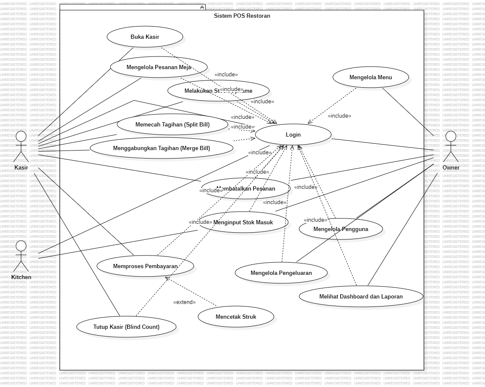
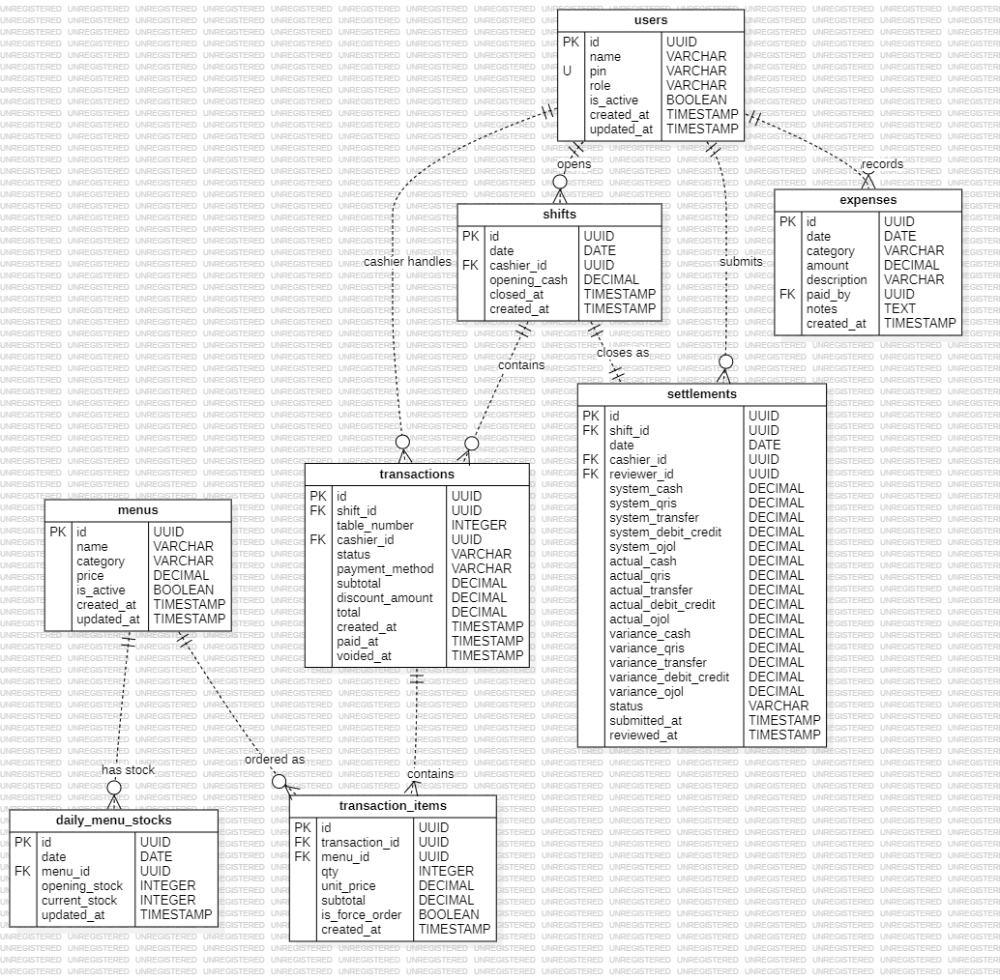

# Full Knowledge - Sistem POS Ayam Bakar Banjar Monosuko (REV 2.11)

Kompilasi lengkap pengetahuan tentang **3 design sistem** yang dipakai di skripsi: Use Case Diagram, Activity Diagram, dan Entity Relationship Diagram. Dokumen ini **self-contained** - reviewer, dosen pembimbing, atau future agent bisa baca satu file ini dan memahami seluruh design.

> ⚠️ **Versi REV 2.11 (2026-05-30).** Selaras balik ke proposal: **drop** subsistem belanja/vendor/raw-materials, **tambah** COGS/modal per menu + Laporan Laba Rugi Harian (Laba Kotor = Pendapatan − COGS, tagihan terpisah). Entitas baseline 14 → **10**, relasi 23 → **17**, UC 20 → **19**, activity diagram 11 → **9**.
>
> Riwayat versi:
> - **REV 2.11 (2026-05-30)** - drop belanja/vendor/raw-materials; tambah `menu_cost_movements` + `menus.cost` + `transaction_items.unit_cost` + `menu_variants.cost_source_menu_id`; laba kotor = pendapatan − COGS (selaras proposal)
> - **REV 2.3 (2026-05-24)** - permission matrix + waiter fallback clarification + login fix (no schema change)
> - **REV 2.2 (2026-05-24)** - audit log raw materials (`raw_material_movements` BARU + rename `stock_movements` → `portion_movements`), 13 → 14 entitas, 17 → 19 relasi
> - **REV 2.1 (2026-05-23)** - order type 2 enum, raw_materials fleksibel, vendor opsional, purchase_items normalized
>
> 3 design utama:
> - Use Case Diagram → [USE-CASE.md](USE-CASE.md) (REV 2.11, **19 UC**, 3 actor - drop pembelian/opname-raw + tambah Kelola Modal/COGS)
> - Activity Diagram → [ACTIVITY.md](ACTIVITY.md) (REV 2.11, **9 diagram** - drop opname-raw + mencatat-pembelian)
> - Entity Relationship Diagram → [ERD.md](ERD.md) (REV 2.11, **10 entitas, 17 relasi**)
>
> Diagram lain (Block Diagram Deployment, Sequence Diagram, Class Diagram, Flowchart Force Order) **tidak dipakai di Bab 3 skripsi** - lihat §10 untuk detail dan alasan.
>
> **Sumber kebenaran tertinggi:** [`docs/operasional-resto.md`](../operasional-resto.md) REV 2.11. Design spec turunan: [`docs/superpowers/specs/2026-05-30-cogs-per-menu-remove-belanja-design.md`](../superpowers/specs/2026-05-30-cogs-per-menu-remove-belanja-design.md). Naskah Bab 3 paste-ready: [BAB-3-DRAFT.md](BAB-3-DRAFT.md).

---

## 1. Konteks Skripsi

**Judul:** Pembuatan Sistem Point of Sales (POS) pada Restoran X (Ayam Bakar Banjar Monosuko)
**Penyusun:** Ezra Brilliant Konterliem (C14220315), Sistem Informasi Bisnis UK Petra.

### 1.1. Masalah yang Dipecahkan (Bab 1.1)

1. Semua order, stok, dan pengeluaran dicatat manual di **satu buku tulis dua sisi**. Kekacauan administrasi: pegawai sering bingung membaca tulisan tangan, terutama saat closing malam.
2. Pegawai sering lupa cek stok porsi di tengah hari. Ketika tiba-tiba habis, pemilik harus mengirim restock darurat dari rumah via Gojek/Grab - biaya operasional membengkak.
3. Pencatatan beberapa metode pembayaran manual → mismatch tidak terdeteksi, rekap rawan salah hitung.
4. Pemilik tidak tahu persis pendapatan + pengeluaran bulanan karena pencatatan tidak terstruktur.

### 1.2. Batasan Penelitian (Bab 1.2)

- **HPP berbasis bahan / Bill of Materials tidak dihitung** karena masak batch tanpa penimbangan baku, komposisi bumbu tidak terdokumentasi. Sebagai gantinya, modal/COGS dinyatakan langsung per menu oleh owner (`menus.cost`). Lihat sub-bab 3.1.4 di [BAB-3-DRAFT.md](BAB-3-DRAFT.md) untuk justifikasi paste-ready.
- **Bahan baku mentah tidak ditrack di sistem** - inventori dibatasi pada barang siap jual satuan porsi; konversi bahan mentah → stok porsi terjadi manual di rumah owner, di luar lingkup. Tidak ada entitas raw materials/vendor/pembelian.
- **Laporan Laba Rugi Harian**: Laba Kotor = Pendapatan − COGS (Σ `unit_cost` × qty dari transaksi paid). Tagihan operasional (bills) ditampilkan terpisah, tidak dikurangkan ke laba kotor.
- **Cetak struk pesanan untuk dapur tidak ada** - dapur produksi di rumah owner, bukan di resto, sehingga komunikasi tetap verbal/kertas.
- **PWA Level A** (installable, butuh internet) - resto tidak punya WiFi internal sehingga pegawai pakai paket data masing-masing HP.

### 1.3. Stack Teknis (implementasi)

- Backend: Node.js 20 + Express 4 + TypeScript + Prisma 6 + MySQL 8
- Frontend: React 18 + Vite + Tailwind + PWA (vite-plugin-pwa)
- Auth: JWT bearer + PIN 6-digit
- Role: `owner`, `cashier`, `waiter` (role lama `kitchen` di REV 1 sudah dihapus - masak out of scope)

---

## 2. Tiga Aktor Sistem (REV 2.3)

| Aktor | Role DB | Tanggung Jawab |
|---|---|---|
| **Pemilik (Owner)** | `owner` | Master data (menu, pengguna), set & ubah modal/COGS menu (+ riwayat modal), input tagihan bulanan, review settlement, monitoring dashboard & laporan laba rugi dari mana saja |
| **Kasir** | `cashier` | Operasional POS shift (Jason, Bryant, Chen Hong). **Primary input order ke POS** (dari kertas waiter). Buka kasir, kelola pesanan, proses bayar dengan bank picker untuk EDC/transfer, split/merge bill, void bebas, tutup kasir (malam), restock pagi, barang masuk darurat, opname stok porsi |
| **Waiter** | `waiter` | Pelayan + helper (Amel, Yanti). **Primary workflow di kertas** (tulis order verbal ke kertas, kasih kasir). Ambil order ke meja, antar makanan, buat & antar minuman, cuci piring, restock pagi, opname stok porsi pagi, mark item habis. **Input order ke POS hanya sebagai fallback** bila kasir tidak available - bukan tugas rutin |

Permission matrix lengkap per role per aksi ada di [`docs/operasional-resto.md`](../operasional-resto.md) seksi "Permission Matrix" REV 2.3. Catatan: Lisa (masak only) tidak punya akun sistem karena masak dilakukan di luar lingkup sistem.

---

## 3. Use Case (ringkasan - detail di [USE-CASE.md](USE-CASE.md))

- **System Boundary:** `Sistem POS Restoran Ayam Bakar Banjar Monosuko`
- **3 Actor** (Pemilik, Kasir, Waiter)
- **19 Use Case** terbagi 4 domain:
  1. **Autentikasi**: `Login` (shared 3 actor - form 2 field input nama + PIN, ketik manual setiap login, no list picker, no localStorage)
  2. **Operasional transaksi**: `Buka Kasir` (kasir-only), `Mengelola Pesanan Meja` (kasir primary + waiter fallback), `Memilih Sub-Pilihan Paket` (kasir primary + waiter fallback), `Memecah Tagihan`, `Menggabungkan Tagihan`, `Membatalkan Pesanan`, `Memproses Pembayaran` (kasir-only, dengan input bank untuk EDC/transfer), `Mencetak Struk`, `Tutup Kasir` (kasir malam)
  3. **Manajemen stok** (shared kasir+waiter): `Restock Stok Porsi`, `Mencatat Barang Masuk`, `Melakukan Opname Stok Porsi`
  4. **Administrasi & laporan**: `Mengelola Menu` (owner), `Kelola Modal/COGS Menu` (owner-only), `Mengelola Pengguna` (owner), `Mencatat Tagihan Bulanan` (owner-only), `Mereview Settlement` (owner), `Melihat Dashboard dan Laporan`
- **Dependencies:** 18× `<<include>>` (semua UC ke `Login`), 3× `<<extend>>` (Mencetak Struk → Pembayaran, Sub-Pilihan → Pesanan, Split Bill → Pembayaran)

> REV 2.11: UC `Mencatat Pembelian` + `Melakukan Opname Raw Materials` dihapus (subsistem belanja/raw-materials keluar dari sistem); UC `Kelola Modal/COGS Menu` ditambah (owner-only).



---

## 4. Activity Diagrams (ringkasan 9 diagram - detail di [ACTIVITY.md](ACTIVITY.md))

| # | Nama | Swimlane | Tujuan |
|---|---|---|---|
| A.1 | Login | User \| Sistem | Autentikasi form 2 field: input nama + PIN 6 digit, ketik manual setiap login (no list picker, no localStorage) |
| A.2 | Order Flow | Waiter \| Kasir \| Sistem | Workflow primary: waiter tulis kertas → kasir input ke POS. Pilih tipe order (2 enum), pilih meja jika dineIn, tambah item, sub-options modal jika paket, decrement stok saat submit (boleh minus). Waiter dapat fallback input langsung saat kasir tidak available |
| A.3 | Pay Flow | Kasir \| Sistem | PB1 10% auto + diskon manual + 6 metode + input bank untuk EDC/transfer + opsi cetak struk PDF |
| A.4 | Restock Stok Porsi Pagi | Waiter/Kasir \| Sistem | Restock kelipatan 5 dengan suggested formula, log audit reason `restock_morning` |
| A.5 | Mencatat Barang Masuk | Kasir/Waiter \| Sistem | Restock darurat tengah hari, stok minus kembali positif, log reason `restock_emergency` |
| A.6 | Opname Stok Porsi | Kasir/Waiter \| Sistem | Cek fisik & koreksi nilai sistem (analog rekonsiliasi cash), log reason `manual_adjust` |
| A.7 | Tutup Kasir | Kasir Malam \| Sistem | Rekap 6 totals + breakdown bank, variance per metode auto-hitung, bukan blind count |
| A.8 | Mencatat Tagihan Bulanan | Owner \| Sistem | Owner-only input tagihan operasional bulanan |
| A.9 | Split & Merge Bill | Kasir \| Sistem | Split per item via party_id, merge antar transaksi meja via self-ref merged_into_id |

> REV 2.11 DROP: Opname Raw Materials + Mencatat Pembelian. `Kelola Modal/COGS Menu` (owner) = CRUD form sederhana, tidak butuh activity diagram terpisah.

### Konvensi Activity (REV 2.3)

- **Action names**: Title Case Indonesia, business language - bukan SQL, field name, atau pseudocode
- **Decision diamond**: wajib punya nama pertanyaan (mis. "Tipe order dine-in?", "Payment EDC atau transfer?", "Pelanggan minta struk?")
- **Guards**: plain text tanpa bracket, Title Case (`Ya`, `Tidak`, `Cash`, `EDC`, ...)
- **Single in/out rule**: percabangan/konvergensi via Decision/Merge, bukan dari action langsung
- **Swimlane**: vertikal, satu lane per aktor + lane untuk Sistem

---

## 5. Entity Relationship Diagram (ringkasan - detail di [ERD.md](ERD.md))

- **10 Entitas:** `users`, `menus` (+ `cost`), `portion_stocks`, `portion_movements` (rename dari `stock_movements`), **`menu_cost_movements`** (REV 2.11 BARU), `shifts`, `transactions`, `transaction_items` (+ `unit_cost`), `settlements`, `bills`
- **17 Relasi**: dominasi 1:N + 1× 1:1 (shifts ↔ settlements) + 1× self-reference (transactions.merged_into_id untuk merge bill) + 1× M:N via junction (transaction_items). REV 2.11 menambah 2 relasi cost-movement (`menus → menu_cost_movements`, `users → menu_cost_movements`) dan menghapus 8 relasi belanja/raw-materials.
- **Notasi**: crow's-foot (bukan Chen)



### Enum Utama (REV 2.2)

| Enum | Values |
|---|---|
| `UserRole` | `owner`, `cashier`, `waiter` |
| `OrderType` | `dineIn`, `takeaway` (disederhanakan dari 5) |
| `PaymentMethod` | `cash`, `edc`, `qris`, `gojek`, `grab`, `transfer` (EDC & transfer + `payment_bank` String? nullable) |
| `PortionMovementReason` | `order`, `restock_morning`, `restock_emergency`, `manual_adjust`, `refund_void` (REV 2.2: rename dari StockMovementReason) |
| `MenuCostChangeReason` | `initialSet`, `manualEdit` (REV 2.11: BARU - log perubahan modal/COGS) |
| `ShiftType` | `pagi`, `malam` |
| `StockType` | `portion`, `linked`, `nonStock` |
| `SettlementStatus` | `submitted`, `reviewed` |
| `BillCategory` | `kebersihan`, `listrik`, `air`, `parkir`, `sewa` |
| `TransactionStatus` | `open`, `paid`, `void` |

### Keputusan Struktural Penting (REV 2.2)

- **`portion_stocks.opening_qty_today`** → auto-snapshot saat user pertama login pagi, untuk metric "terjual hari ini"
- **`transactions.payment_bank`** → nullable, terisi hanya untuk EDC/transfer agar laporan rekonsiliasi per bank dapat dilakukan
- **`transactions.merged_into_id`** → self-reference nullable untuk merge bill (transaksi sumber → parent gabungan)
- **`menus.cost` (REV 2.11)** → modal/COGS per unit, owner-only, tidak dibocorkan ke katalog publik (POS). Diisi di SKU leaf + menu simple.
- **`transaction_items.unit_cost` (REV 2.11)** → snapshot modal per unit saat order (mirror `unit_price`), sehingga laba kotor periode lampau tidak berubah saat owner memperbarui modal.
- **`menu_variants.cost_source_menu_id` (REV 2.11)** → SKU leaf wakil modal untuk varian nonStock (Es Teh per-ukuran, Es Jeruk, Tahu Tempe).
- **TIDAK ada raw materials / Bill of Materials / resep** - inventori = finished-goods porsi saja; modal dinyatakan langsung per menu (HPP berbasis bahan out of scope). Konversi bahan mentah → stok porsi manual di rumah owner.
- **Audit log dipisah per domain**:
  - `portion_movements` (rename dari `stock_movements`) → audit stok porsi, FK ke `menus` + `users` (+ REV 2.8 FK ke transaksi sumber)
  - `menu_cost_movements` (REV 2.11 BARU) → audit perubahan modal/COGS menu, FK ke `menus` + `users`; auto-insert saat `upsertMenu` mengubah `cost`

Data dictionary lengkap (10 tabel × Field/Tipe/Keterangan) ada di [`docs/DATA-DICTIONARY.md`](../DATA-DICTIONARY.md) REV 2.11.

---

## 6. Mapping ke Rumusan Masalah Skripsi

| Rumusan Masalah (Bab 1.2) | Use Case yang menjawab | Activity Diagram | Entitas ERD |
|---|---|---|---|
| A. Percepat durasi transaksi | `Mengelola Pesanan Meja` (2 tipe sederhana) + `Memilih Sub-Pilihan Paket` + `Memproses Pembayaran` (bank picker autocomplete) | A.2 Order Flow + A.3 Pay Flow | `transactions`, `transaction_items`, `menus` |
| B. Percepat rekonsiliasi + kurangi mismatch | `Tutup Kasir` (rekap 6 totals + breakdown bank, variance per metode) | A.8 Tutup Kasir | `settlements`, `shifts`, `transactions` (dengan payment_bank) |
| C. Manajemen stok harian + restock darurat | `Restock Stok Porsi` + `Mencatat Barang Masuk` + `Opname Stok Porsi` | A.4, A.5, A.6 | `portion_stocks`, `portion_movements` |
| #4 Owner tahu laba & pengeluaran | `Kelola Modal/COGS Menu` + `Mencatat Tagihan Bulanan` + `Melihat Dashboard dan Laporan` (laba = pendapatan − COGS, tagihan terpisah) | A.8 | `menus.cost`, `transaction_items.unit_cost`, `menu_cost_movements`, `bills` |

---

## 7. Status Build (REV 2.3, per 2026-05-24)

| Komponen | Status |
|---|---|
| `docs/operasional-resto.md` (ground truth) | ✅ Final REV 2.3 (tambah seksi Permission Matrix) |
| `docs/superpowers/specs/2026-05-24-permission-matrix-design.md` | ✅ NEW REV 2.3 (design spec brainstorming) |
| `CLAUDE.md` (handoff state) | ✅ REV 2.3 |
| `~/.claude/plans/...` (plan refactor 11 phases) | ⏳ Masih REV 2.1 (perlu sync ke REV 2.3 saat mulai eksekusi - tambah permission middleware granular di Phase 4 backend) |
| `docs/knowledge/ERD.md` | ✅ REV 2.3 (schema identik REV 2.2 - 14 entitas, 19 relasi) |
| `docs/knowledge/USE-CASE.md` | ✅ REV 2.3 (20 UC, 3 actor + waiter fallback clarification + Login fix) |
| `docs/knowledge/ACTIVITY.md` | ✅ REV 2.3 (11 activity diagrams + A.2 fallback note, no visual change) |
| `docs/knowledge/BAB-3-DRAFT.md` | ⏳ REV 2.2 (kalau dipakai untuk skripsi, perlu sync ke REV 2.3 untuk Login narration + workflow waiter) |
| `docs/knowledge/FULL.md` | ✅ REV 2.3 (this file) |
| `Skripsi.mdj` (StarUML - ERD) | ✅ REV 2.2 (14 entitas via Mermaid, REV 2.3 tidak butuh rebuild) |
| `Skripsi.mdj` (StarUML - 11 Activity Diagrams) | ✅ REV 2.2 (REV 2.3 tidak butuh rebuild, no step change) |
| `Skripsi.mdj` (StarUML - Use Case) | ⏳ Pending rebuild untuk REV 2.3 annotation update |
| `docs/DATA-DICTIONARY.md` | ⏳ Masih REV 1 - perlu update ke 14 entitas REV 2.2/2.3 |
| `backend/prisma/schema.prisma` | ⏳ Masih REV 2 - perlu rewrite ke 14 entitas REV 2.2 (REV 2.3 tidak menambah schema, hanya middleware permission granular) |
| `backend/prisma/menu-catalog.ts` + `seed.ts` | ⏳ Masih REV 2 |
| Backend code (services/controllers/middleware) | ⏳ Masih REV 2 - REV 2.3 perlu granular permission middleware per-aksi |
| Frontend code (LoginPage form input nama+PIN, POSPage 2-tab, 3 dashboard per role) | ⏳ Masih REV 2 |

Plan eksekusi step-by-step ada di [`~/.claude/plans/ubah-backend-dari-laravel-crystalline-wilkes.md`](~/.claude/plans/ubah-backend-dari-laravel-crystalline-wilkes.md).

---

## 8. Modal/COGS per Menu + Bill of Materials (Out of Scope)

> Modal/COGS dinyatakan langsung per menu oleh owner (`menus.cost`), bukan dihitung dari konsumsi bahan baku terukur per siklus produksi. Perhitungan HPP berbasis bahan memerlukan penimbangan baku dan komposisi bumbu terdokumentasi - tidak tersedia pada restoran kecil keluarga yang memasak batch dengan racikan tidak tetap. Karena itu Bill of Materials / resep dan pencatatan bahan baku mentah tidak masuk lingkup sistem.

**Implikasi struktural pada ERD:**
- Inventori yang ditrack hanya `portion_stocks` (finished goods). Tidak ada entitas raw materials/vendor/pembelian.
- Tidak ada Bill of Materials / resep yang men-decrement bahan mentah saat order masuk.
- Modal/COGS melekat per menu (`menus.cost`), di-snapshot per item transaksi (`transaction_items.unit_cost`), dengan jejak perubahan di `menu_cost_movements`.
- Laporan owner: **Pendapatan total per periode (dari transactions) − COGS total per periode (Σ unit_cost × qty) = Laba Kotor**. Tagihan operasional (`bills`) ditampilkan terpisah, tidak dikurangkan ke laba kotor.

Paragraf paste-ready untuk skripsi (Bab 1.2 Batasan + Bab 3.1.4) ada di [`docs/operasional-resto.md`](../operasional-resto.md) seksi "Bill of Materials / HPP per Bahan (Out of Scope)" + "COGS per Menu + Laporan Laba Rugi Harian", dan [BAB-3-DRAFT.md](BAB-3-DRAFT.md) sub-bab 3.1.4.

---

## 9. Konvensi Global

### Bahasa
- **Indonesian Title Case** untuk nama elemen yang orang awam baca (actor, use case, activity action)
- **snake_case English-Indonesian mix** untuk nama tabel, kolom, enum value
- **Bahasa bisnis** untuk activity actions - hindari SQL/code/pseudocode

### Naming Pola
- Entity ERD: lowercase snake_case (`users`, `portion_stocks`, `transaction_items`, `menu_cost_movements`)
- Primary key: `id` (INT auto-increment), kecuali `portion_stocks` (PK = `menu_id` karena 1:1 dengan Menu)
- Foreign key: `<entity>_id` (contoh: `menu_id`, `cashier_id`, `shift_id`, `transaction_id`, `user_id`)
- Enum values: lowercase underscore (`cash`, `edc`, `restock_morning`, `bumbu_dasar`)

### Konsistensi Arrow Direction (Use Case)
- `<<include>>`: panah **ke UC yang jalan dulu** (biasanya ke Login)
- `<<extend>>`: panah **ke base UC** (extending jalan opsional)
- Generalization (hollow triangle): panah ke **parent/superclass** - saat ini tidak dipakai di sistem POS

### Konsistensi Decision di Activity
- Pertanyaan jelas: "Tipe order dine-in?", "Item paket?", "Payment EDC atau transfer?"
- Guard `Ya`/`Tidak` Title Case tanpa bracket
- Single merge untuk multiple exclusive path konvergen

---

## 10. Diagram yang TIDAK Dipakai di Skripsi REV 2.3

Per arahan pembimbing dan keputusan scope skripsi, hanya 3 design (Use Case, Activity, ERD) yang dipakai di Bab 3. Berikut diagram lain yang **tidak dipakai** beserta alasannya:

| Diagram | Status | Alasan |
|---|---|---|
| **Block Diagram (Deployment)** | ❌ Tidak dipakai | Pedoman SIB UK Petra menyebut sub-bab 3.2.1 Blok Diagram Desain Sistem, tetapi pembimbing membatasi cakupan diagram pada *use case*, *activity*, dan ERD saja. Detail topology fisik (HP kasir/waiter, server cloud, komunikasi via paket data) cukup dijelaskan di Bab 4 implementasi/deployment, bukan di Bab 3 desain. |
| **Sequence Diagram** | ❌ Tidak dipakai | ADSI Bab 10 menyebut sequence diagram untuk skenario kritis (login, pembayaran, dst.), tetapi pembimbing menilai *activity diagram* dengan swimlane sudah cukup menjelaskan alur interaksi untuk skripsi POS yang dominan transaksional. Sequence diagram akan menambah jumlah halaman tanpa menambah pemahaman baru. |
| **Class Diagram** | ❌ Tidak dipakai | Skripsi POS pakai pendekatan basis data relasional dengan ERD sebagai blueprint struktur data. Class diagram OOP (attribute + method + inheritance) tidak menambah informasi baru di atas ERD untuk konteks ini. Jika dibutuhkan, struktur model di backend (Prisma) dapat dilihat langsung di Bab 4 implementasi. |
| **Flowchart Force Order** | ❌ Tidak dipakai (obsolete) | REV 1 dan REV 2 sempat punya konsep "force order" (kasir bisa lanjut order meski stok habis dengan flag `is_force_order=true`). REV 2.1 **menghapus konsep force order** dan menggantinya dengan kebijakan "stok porsi boleh minus" + fitur "Barang Masuk" untuk restock darurat. Karena konsep yang di-flowchart-kan sudah tidak ada di sistem, flowchart-nya juga obsolete. |

### Apa yang terjadi dengan file existing dari diagram tidak dipakai?

File source dan PNG dari diagram-diagram di atas masih ada di repository (jejak iterasi REV 1 dan REV 2):

```
docs/diagrams/
├── blok-diagram-sistem-pos-ayam-bakar-banjar-monosuko.png    (S.1 - tidak dipakai)
├── sequence-diagram-*.png (5 file)                            (SQ.1-5 - tidak dipakai)
├── flowchart-force-order.png                                  (S.8 - obsolete)
└── (class-diagram tidak pernah dibuat)
```

```
.claude/skills/
├── block-diagram/        (skill internal, tetap ada untuk reference)
├── sequence-diagram/     (skill internal)
├── class-diagram/        (skill internal)
└── flowchart/            (skill internal)
```

**Keputusan**: file-file di atas **tidak di-rujuk** di Bab 3 skripsi maupun di dokumen knowledge ini. File tetap dipertahankan di repository sebagai jejak iterasi desain (audit trail), tetapi tidak akan dipakai untuk evaluasi pembimbing/penguji. Pembersihan file (delete/archive) bersifat opsional dan dapat ditunda hingga proyek selesai untuk menghindari kehilangan jika ternyata pembimbing meminta salah satu untuk dipertimbangkan ulang.

---

## 11. Output Files (3 Design + Dokumentasi REV 2.3)

### Diagrams (PNG export) di `docs/diagrams/` - yang DIPAKAI

PNG visual ekspor dari `Skripsi.mdj`. Filename target (akan di-export saat StarUML rebuild):

```
use-case-diagram-sistem-pos-restoran.png           (UC, pending rebuild REV 2.11 - 19 UC)
activity-diagram-login.png                         (A.1)
activity-diagram-order-flow.png                    (A.2, 2 tipe order + fallback waiter)
activity-diagram-pay-flow.png                      (A.3, bank picker)
activity-diagram-restock-stok-porsi-pagi.png       (A.4)
activity-diagram-mencatat-barang-masuk.png         (A.5)
activity-diagram-opname-stok-porsi.png             (A.6)
activity-diagram-tutup-kasir.png                   (A.7, breakdown bank)
activity-diagram-mencatat-tagihan.png              (A.8)
activity-diagram-split-merge-bill.png              (A.9, self-ref merge)
erd-sistem-pos-restoran.png                        (ERD, 10 entitas REV 2.11 - pending rebuild)
```
> REV 2.11: PNG `activity-diagram-opname-raw-materials.png` + `activity-diagram-mencatat-pembelian.png` tidak lagi dipakai (UC/activity-nya dihapus).

### StarUML Source
```
Skripsi.mdj   (ERD + 11 Activity sudah REV 2.2; UC pending rebuild untuk REV 2.3)
```

### Dokumentasi (3 design + spec turunan)
```
docs/knowledge/
├── USE-CASE.md       (§3 - REV 2.3)
├── ACTIVITY.md       (§4 - REV 2.3)
├── ERD.md            (§5 - REV 2.3, schema identik REV 2.2)
├── BAB-3-DRAFT.md    (naskah paste-ready Bab 3 - masih REV 2.2, perlu sync REV 2.3 kalau dipakai)
└── FULL.md           (this file - kompilasi 3 design REV 2.3)

docs/
├── operasional-resto.md   (ground truth REV 2.3, sumber kebenaran tertinggi)
├── DATA-DICTIONARY.md     (masih REV 1, perlu rewrite ke 14 entitas)
└── superpowers/specs/2026-05-24-permission-matrix-design.md   (design spec turunan REV 2.3)
```

---

## 12. Referensi Konvensi

- **ADSI Modul Pembelajaran** - Bab 5 (Use Case), Bab 7 (Activity)
- **Pedoman Program SIB UK Petra** (`docs/Pedoman Program SIB.pdf`)
- **3 skripsi POS UK Petra** yang distudi:
  - Cross-channel strategy pada Resto X (Gobiz integration)
  - Supermarket XYZ dengan metode Market Basket Analysis
  - Toko X dengan analisis ABC-VED (inventory control)
- **Skills internal** di `.claude/skills/` - use-case-diagram, activity-diagram, erd-diagram (3 skill yang dipakai), block-diagram, sequence-diagram, class-diagram, flowchart (4 skill tidak dipakai tetapi tetap ada untuk reference internal)

## 13. Memory Snapshot (untuk future agents)

Memory feedback yang accumulated selama build (per file [MEMORY.md](C:\Users\ezrak\.claude\projects\c--Users-ezrak-Documents-Skripsi-Skripsi-POS-Restaurant\memory\MEMORY.md)):

- **Tanya resto dulu sebelum desain operasional baru** (`feedback_ask_resto_specifics`) - jangan asumsi dari template POS generik
- **Catat tiap selesai untuk continuity sesi** (`feedback_log_everything_for_session_continuity`)
- **Build incremental** (`feedback_incremental_build`) - satu file per step, explain + wait for review
- **Stick to chosen path** (`feedback_stick_to_chosen_path`) - jangan re-suggest alternative yang sudah ditolak
- **ERD pakai Mermaid generate_diagram** (`feedback_erd_use_mermaid`) - `create_element ERDColumn` taruh ke `ownedElements`, compartment view kosong
- **Activity bahasa bisnis** (`feedback_activity_business_language`) - no SQL/field names
- **Atomicity UC**: konsolidasi over-split UC (5 "Melihat Laporan" → 1 "Melihat Dashboard dan Laporan")
- **Decision names + guards**: diamond diberi nama pertanyaan, guards plain text tanpa bracket
- **HPP berbasis bahan / BoM out of scope** - modal/COGS dinyatakan langsung per menu (`menus.cost`), tidak ada raw materials, tidak ada resep auto-decrement

Memory files lengkap di `C:\Users\ezrak\.claude\projects\c--Users-ezrak-Documents-Skripsi-Skripsi-POS-Restaurant\memory\`.

---

*Dokumen ini auto-compiled dari USE-CASE.md, ACTIVITY.md, ERD.md + integrations. Update bersamaan kalau diagram/design berubah.*
